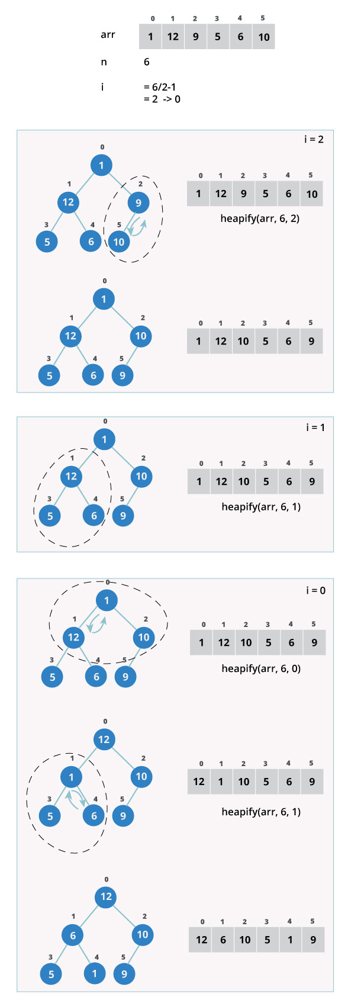
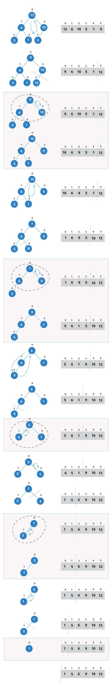

# Data Structure and Algorithms

## Array/Matrix

Even though both are in effect a representation of a list of lists we can use the `array` and `numpy` package.

* 2-D Arrays

```python
from array import *

T = [[11, 12, 5, 2], [15, 6,10], [10, 8, 12, 5], [12,15,8,6]]

# insert
T.insert(2, [0,5,11,13,6])

# update
T[2] = [11, 9]
T[0][3] = 7

# delete
del T[3]

for r in T:
    for c in r:
        print(c, end = " ")
    print()
```

* Matrix 

```python
rom numpy import *

a = array([['Mon',18,20,22,17],['Tue',11,18,21,18],
		   ['Wed',15,21,20,19],['Thu',11,20,22,21],
		   ['Fri',18,17,23,22],['Sat',12,22,20,18],
		   ['Sun',13,15,19,16]])

print(a.shape)
# Not needed but can be helpful
m = reshape(a, (7, 5))
print(m)

# add a row
m_r = append(m, [['Avg', 12, 15, 13, 11]], 0)

# add a column
m_c = insert(m, [5], [[1],[2],[3],[4],[5],[6],[7]], 1)

# delete a row
m = delete(m , [2], 0)

# delete a column
# s_ = numpy index trick
m = delete(m, s_[2], 1)

# update a row
m[3] = ['Thu',0,0,0,0]
```

## Sets

```python
# Note to create an empty set we have to
Empty_Set = set()

Days=set(["Mon","Tue","Wed","Thu","Fri","Sat"])
 
for d in Days:
	print(d)

# add
Days.add("Sun")

# remove item from set
Days.discard("Sun")

# We can check for union of sets
result = setA | setB

# intersect
result = setA & setB

# difference
result = setA - setB

# compare
result = setA <= setB 
```

## ChainMap

```python
import collections

dict1 = {'day1': 'Mon', 'day2': 'Tue'}
dict2 = {'day3': 'Wed', 'day1': 'Thu'}

res = collections.ChainMap(dict1, dict2)

# Creating a single dictionary
# [{'day1': 'Mon', 'day2': 'Tue'}, {'day1': 'Thu', 'day3': 'Wed'}] 
print(res.maps,'\n')

print('Keys = {}'.format(list(res.keys())))
print('Values = {}'.format(list(res.values())))
print()

# Print all the elements from the result
print('elements:')
for key, val in res.items():
    print('{} = {}'.format(key, val))
print()

# Find a specific value in the result
print('day3 in res: {}'.format(('day1' in res)))
print('day4 in res: {}'.format(('day4' in res)))

# update map
dict2['day4'] = 'Fri'
```

## Linked List \(simple\)

```python
class Node:
    def __init__(self, data=None):
        self.data = data
        self.next = None
        
class SLinkedList:
    def __init__(self):
        self.head = None
        
lst = SLinkedList()
lst.head = Node("mon")

# link first node to second node
day2 = Node("Tue")
lst.head.next = day2

# link second node to third node
day3 = Node("Wed")
day2.next = day3
```

### Traverse a linked list

we need to add the following function to the `SLinkedList` Class:

```python
def listPrint(self):
    value = self.head
    while value is not None:
        print(value.data)
        value = value.next
        
lst.listPrint()
```

### Insertion in a Linked List

At the beginning of a linked list, we need to add 

```python
def insertAtStart(self, newData):
    newNode = Node(newData)
    # Update the new nodes next value to existing node
    newNode.next = self.head
    self.head = newNode
    
lst.insertAtStart("Sun")
```

Append to a linked list

```python
def append(self, newData):
    newNnode = Node(newData)
    if self.head is None:
        self.head = newNode
        return
    
    # steping thru the list to the end
    last = self.head
    while last.next:
        last = last.next
        
    last.next = newNode
    
    
lst.append("Thu")
```

Insert in between two data nodes

```python
def insert(self, middleNode, newData):
    if middleNode is None:
        print("{} does not exist".format(middleNode))
        return
        
    newNode = Node(newData)
    newNode.next = middleNode.next
    middleNode.next = newNode
    

lst.insert(lst.head.next, "Fri")
```

Remove an item from a linked list

```python
def insertAtStart(self, key):
    headVal = self.head
    if headVal is not None:
        if headVal.data == key:
            self.head = headVal.next
            headVal = None
            return
            
    while headVal is not None:
        if headVal.data == key:
            break
            
        prev = headVal
        headVal = headVal.next
        
    if headVal is None:
        return
        
    prev.next = headVal.next
    headVal = None
    
    
llist = SLinkedList()
llist.insertAtStart("Mon")
llist.insertAtStart("Tue")
llist.insertAtStart("Wed")
llist.insertAtStart("Thu")
llist.insertAtStart("Tue")
llist.listPrint()
```

## Doubly Linked List 

We can use the same approach as in the Singly Linked List but the head and next pointer will be used for proper assignation to create two links in each of the nodes in addition to the data present in the node.

See [Linked Lists in Python](linked-lists-in-python.md).

## [Stack](https://dbader.org/blog/stacks-in-python)/[Queue](https://dbader.org/blog/queues-in-python)

For both we can use the build-in **`list`** type but as a good default choice - if you are not looking for parallel processing support - it is recommended to use **`colloctions.deque`**. There is also `queue.LifoQueue` Class. 

### Stack

```python
# How to use collections.deque as a stack (LIFO):
from collections import deque 

q = deque()

q.append('Mon')
q.append('Tue')
q.append('Wed')

# Remove and return an element from the right side of the deque.
q.pop()
```

### Queue

```python
# How to use collections.deque as a FIFO queue:

# Remove and return an element from the left side of the deque.
q.popleft()
```

If multiprocessing is needed you can use the \`[multiprocessing.Queue](https://docs.python.org/3/library/multiprocessing.html#multiprocessing.Queue) Class\`. This is a shared job queue implementation that allows queued items to be processed in parallel by multiple concurrent workers. Process-based parallelization is popular in Python due to the [global interpreter lock \(GIL\)](https://wiki.python.org/moin/GlobalInterpreterLock).

`multiprocessing.Queue` is meant for sharing data between processes and can store any pickle-able object.

## Hash Table / Dictionary

In Python, the Dictionary data types represent the implementation of hash tables. The Keys in the dictionary satisfy the following requirements.

* The keys of the dictionary are hashable i.e. the are generated by hashing function which generates unique result for each unique value supplied to the hash function.
* The order of data elements in a dictionary is not fixed.

## Binary Tree

### Create

Tree represents the nodes connected by edges. It is a non-linear data structure. It has the following properties.

* One node is marked as Root node.
* Every node other than the root is associated with one parent node.
* Each node can have an arbitrary number of chid node.

We can create our own tree structure using the concept of nodes from above. We designate one node as root node and then add more nodes as child nodes.

```python
class Node:
    def __init__(self, data):
        self.left = None
        self.right = None
        self.data = data
        
    def printTree(self):
        print(self.data)
        
root = Node(10)
root.printTree()  # returns 10
```

The following is definition of Binary Search Tree\(BST\) according to [Wikipedia](http://en.wikipedia.org/wiki/Binary_search_tree)

Binary Search Tree, is a node-based binary tree data structure which has the following properties:

* The left subtree of a node contains only nodes with keys lesser than the node’s key.
* The right subtree of a node contains only nodes with keys greater than the node’s key.
* The left and right subtree each must also be a binary search tree. There must be no duplicate nodes.


The above properties of Binary Search Tree provide an ordering among keys so that the operations like search, minimum and maximum can be done fast. If there is no ordering, then we may have to compare every key to search a given key.

### Search

To search a given key in Binary Search Tree, we first compare it with root, if the key is present at root, we return root. If key is greater than root’s key, we recur for right subtree of root node. Otherwise we recur for left subtree.

```python
# A utility function to search a given key in BST 
def search(root, key): 
	
	# Base Cases: root is null or key is present at root 
	if root is None or root.value == key: 
		return root 

	# Key is greater than root's key 
	if root.value < key: 
		return search(root.right, key) 
	
	# Key is smaller than root's key 
	return search(root.left, key) 
```

**Insertion of a key**

A new key is always inserted at leaf. We start searching a key from root till we hit a leaf node. Once a leaf node is found, the new node is added as a child of the leaf node.

```text
         100                               100
        /   \        Insert 40            /    \
      20     500    --------->          20     500 
     /  \                              /  \  
    10   30                           10   30
                                              \   
                                              40
```

```python
# A utility class that represents an individual node in a BST 
class Node: 
	def __init__(self, key): 
		self.left = None
		self.right = None
		self.value = key 

# A utility function to insert a new node with the given key 
def insert(root, node): 
	if root is None: 
		root = node 
	else: 
		if root.value < node.value: 
			if root.right is None: 
				root.right = node 
			else: 
				insert(root.right, node) 
		else: 
			if root.left is None: 
				root.left = node 
			else: 
				insert(root.left, node) 

# A utility function to do inorder tree traversal 
def inorder(root): 
	if root: 
		inorder(root.left) 
		print(root.value) 
		inorder(root.right) 


# Driver program to test the above functions 
# Let us create the following BST 
#	  50 
#    /	\ 
#   30	 70 
#  / \   / \ 
# 20 40 60 80 
r = Node(50) 
insert(r, Node(30)) 
insert(r, Node(20)) 
insert(r, Node(40)) 
insert(r, Node(70)) 
insert(r, Node(60)) 
insert(r, Node(80)) 

# Print inoder traversal of the BST 
inorder(r) 
```

## Heaps / [queue.PriorityQueue](https://docs.python.org/3/library/queue.html#queue.PriorityQueue) Class

A priority queue is a container data structure that manages a set of records with [totally-ordered](https://en.wikipedia.org/wiki/Total_order) keys \(for example, a numeric _weight_ value\) to provide quick access to the record with the _smallest_ or _largest_ key in the set.

```python
from queue import PriorityQueue

q = PriorityQueue()

q.put((2, 'code'))
q.put((1, 'eat'))
q.put((3, 'sleep'))

while not q.empty():
    next_item = q.get()
    print(next_item)

# Result:
#   (1, 'eat')
#   (2, 'code')
#   (3, 'sleep')
```

## Graphs


```text
V = {a, b, c, d, e}
E = {ab, ac, bd, cd, de}
```

We can present this graph in a python program as below.

```python
# Create the dictionary with graph elements
graph = { "a" : ["b","c"],
          "b" : ["a", "d"],
          "c" : ["a", "d"],
          "d" : ["e"],
          "e" : ["d"]
         }

# Print the graph 		 
print(graph)
```

When the above code is executed, it produces the following result −

```text
{'c': ['a', 'd'], 'a': ['b', 'c'], 'e': ['d'], 'd': ['e'], 'b': ['a', 'd']}
```

We can create our own `dict` like above or can use `collections.defaultdict` , for example:

```python
from collections import defaultdict

g = [("a", "b"), ("a", "c"), ("b", "a"), ("b", "d"), ("c", "a"), ("c", "d"), ("d", "e"), ("e", "d")]
d = defaultdict(list)
for k, v in g:
    d[k].append(v)

print(d)
# defaultdict(<type 'list'>, {'a': ['b', 'c'], 'c': ['a', 'd'], 'b': ['a', 'd'], 'e': ['d'], 'd': ['e']})

```

## Algorithm Design

Algorithm is a step-by-step procedure, which defines a set of instructions to be executed in a certain order to get the desired output. Algorithms are generally created independent of underlying languages, i.e. an algorithm can be implemented in more than one programming language.

From the data structure point of view, following are some important categories of algorithms:

* **Search** − Algorithm to search an item in a data structure.
* **Sort** − Algorithm to sort items in a certain order.
* **Insert** − Algorithm to insert item in a data structure.
* **Update** − Algorithm to update an existing item in a data structure.
* **Delete** − Algorithm to delete an existing item from a data structure.

### Characteristics of an Algorithm

Not all procedures can be called an algorithm. An algorithm should have the following characteristics:

* **Unambiguous** − Algorithm should be clear and unambiguous. Each of its steps \(or phases\), and their inputs/outputs should be clear and must lead to only one meaning.
* **Input** − An algorithm should have 0 or more well-defined inputs.
* **Output** − An algorithm should have 1 or more well-defined outputs, and should match the desired output.
* **Finiteness** − Algorithms must terminate after a finite number of steps.
* **Feasibility** − Should be feasible with the available resources.
* **Independent** − An algorithm should have step-by-step directions, which should be independent of any programming code.

### How to Write an Algorithm?

There are no well-defined standards for writing algorithms. Rather, it is problem and resource dependent. Algorithms are never written to support a particular programming code.

As we know that all programming languages share basic code constructs like loops \(do, for, while\), flow-control \(if-else\), etc. These common constructs can be used to write an algorithm.

We write algorithms in a step-by-step manner, but it is not always the case. Algorithm writing is a process and is executed after the problem domain is well-defined. That is, we should know the problem domain, for which we are designing a solution.

#### Example

Let's try to learn algorithm-writing by using an example.

**Problem** − Design an algorithm to add two numbers and display the result.

```text
step 1 − START
step 2 − declare three integers a, b & c
step 3 − define values of a & b
step 4 − add values of a & b
step 5 − store output of step 4 to c
step 6 − print c
step 7 − STOP
```

Algorithms tell the programmers how to code the program. Alternatively, the algorithm can be written as −

```text
step 1 − START ADD
step 2 − get values of a & b
step 3 − c ← a + b
step 4 − display c
step 5 − STOP
```

In design and analysis of algorithms, usually the second method is used to describe an algorithm. It makes it easy for the analyst to analyze the algorithm ignoring all unwanted definitions. He can observe what operations are being used and how the process is flowing.

Writing **step numbers**, is optional.

We design an algorithm to get a solution of a given problem. A problem can be solved in more than one ways.


Hence, many solution algorithms can be derived for a given problem. The next step is to analyze those proposed solution algorithms and implement the best suitable solution.

## Divide and Conquer


1. **Divide/Break**

   Breaking the problem into smaller sub-problems

2. **Conquer/Solve**

   This step receives a lot of smaller sub-problems to be solved.

3. **Merge/Combine**

   Recursively combines all solved sub-problems.

### Binary Search implementation

In binary search we take a sorted list of elements and start looking for an element at the middle of the list. If the search value matches with the middle value in the list we complete the search. Otherwise we eliminate half of the list of elements by choosing whether to proceed with the right or left half of the list depending on the value of the item searched. This is possible as the list is **sorted** and it is much quicker than linear search. Here we divide the given list and conquer by choosing the proper half of the list. We repeat this approach till we find the element or conclude about it's absence in the list.

```python
def bsearch(list, val):
    idx0 = 0
    idxn = len(list) - 1
    
    # Find the middle most value
    while idx0 <= idxn:
        midval = (idx0 + idxn) // 2

        if list[midval] == val:
            return midval
            
        # Compare the value the middle most value
        if val > list[midval]:
            idx0 = midval + 1
        else:
            idxn = midval - 1

    if idx0 > idxn:
        return None
        
# Initialize the sorted list
list = [2, 7, 19, 34, 53, 72]

# Print the search result
print(bsearch(list, 72))
print(bsearch(list, 11))
```

When the above code is executed, it produces the following result:

```text
5
None
```

### Binary Search using Recursion

We implement the algorithm of binary search using python as shown below. We use an ordered list of items and design a recursive function to take in the list along with starting and ending index as input. Then the binary search function calls itself till find the the searched item or concludes about its absence in the list.

```python
def bsearch(list, idx0, idxn, val):
    if (idxn < idx0):
        return None
    else:
        midval = idx0 + ((idxn - idx0) // 2)
        
        # Compare the search item with middle most value
        if list[midval] > val:
            return bsearch(list, idx0, midval - 1, val)
        elif list[midval] < val:
            return bsearch(list, midval + 1, idxn, val)
        else:
            return midval


list = [8, 11, 24, 56, 88, 131]

# Instead of hardcode the start and end index we can should list[0] and list[-1]
print(bsearch(list, 0, 5, 24))
print(bsearch(list, 0, 5, 51))
```

When the above code is executed, it produces the following result:

```text
2
None
```

## Backtracking

Backtracking is a form of recursion. But it involves choosing only option out of any possibilities. We begin by choosing an option and backtrack from it, if we reach a state where we conclude that this specific option does not give the required solution. We repeat these steps by going across each available option until we get the desired solution.

Below is an example of finding all possible order of arrangements of a given set of letters. When we choose a pair we apply backtracking to verify if that exact pair has already been created or not. If not already created, the pair is added to the answer list else it is ignored.

```python
def permute(list, s):
    if list == 1:
        return s
    else:
        return [y + x
                for y in permute(1, s)
                for x in permute(list - 1, s)
                ]


print(permute(1, ["a", "b", "c"]))
print(permute(2, ["a", "b", "c"]))
```

When the above code is executed, it produces the following result −

```text
['a', 'b', 'c']
['aa', 'ab', 'ac', 'ba', 'bb', 'bc', 'ca', 'cb', 'cc']
```

##  Tree Traversal Algorithms

Also check out [PROGRAMIZ](https://www.programiz.com/dsa/tree-traversal).

Traversal is a process to visit all the nodes of a tree and may print their values too. Because, all nodes are connected via edges \(links\) we always start from the root \(head\) node. That is, we cannot randomly access a node in a tree. There are three ways which we use to traverse a tree


Depth First Traversals:  
\(a\) In-order \(Left, Root, Right\) : 4 2 5 1 3  
\(b\) Pre-order \(Root, Left, Right\) : 1 2 4 5 3  
\(c\) Post-order \(Left, Right, Root\) : 4 5 2 3 1

Breadth First or Level Order Traversal : 1 2 3 4 5  
Please see [this ](https://www.geeksforgeeks.org/level-order-tree-traversal/)post for Breadth First Traversal.

### In-order Traversal

In this traversal method, the left subtree is visited first, then the root and later the right sub-tree. We should always remember that every node may represent a subtree itself.

```text
Algorithm Inorder(tree)
   1. Traverse the left subtree, i.e., call Inorder(left-subtree)
   2. Visit the root.
   3. Traverse the right subtree, i.e., call Inorder(right-subtree)
```

```python
# left -> root -> right
def inorderTraversal(self, root):
    result = []
    if root:
        result = self.inorderTraversal(root.left)
        result.append(root.data)
        result = result + self.inorderTraversal(root.right)
    
    return result
    
    
root = Node(27)
root.insert(14)
root.insert(35)
root.insert(10)
root.insert(19)
root.insert(31)
root.insert(42)
# [27, 14, 35, 10, 19, 31, 42]
print(root.inorderTraversal(root))
```

```text
[10, 14, 19, 27, 31, 35, 42]
```

### Pre-order Traversal

In this traversal method, the root node is visited first, then the left subtree and finally the right subtree.

```text
Algorithm Preorder(tree)
   1. Visit the root.
   2. Traverse the left subtree, i.e., call Preorder(left-subtree)
   3. Traverse the right subtree, i.e., call Preorder(right-subtree) 
```

```python
# root -> left -> right
def preorderTraversal(self, root):
    result = []
    if root:
        result.append(root.data)
        result = result + self.inorderTraversal(root.left)
        result = result + self.inorderTraversal(root.right)
    
    return result
    
print(root.preorderTraversal(root))
```

```text
[27, 14, 10, 19, 35, 31, 42]
```

### Post-order Traversal

In this traversal method, the root node is visited last, hence the name. First we traverse the left subtree, then the right subtree and finally the root node.

```text

```

```text
Algorithm Postorder(tree)
   1. Traverse the left subtree, i.e., call Postorder(left-subtree)
   2. Traverse the right subtree, i.e., call Postorder(right-subtree)
   3. Visit the root.
```

```python
# left -> right -> root
def preorderTraversal(self, root):
    result = []
    if root:
        result = self.inorderTraversal(root.left)
        result = result + self.inorderTraversal(root.right)
        result.append(root.data)
    
    return result
    
print(root.postorderTraversal(root))
```

```text
[10, 19, 14, 31, 42, 35, 27]
```

#### code by geekforgeeks.org

```python
# Python program to for tree traversals 
  
# A class that represents an individual node in a 
# Binary Tree 
class Node: 
    def __init__(self,key): 
        self.left = None
        self.right = None
        self.val = key 
  
  
# A function to do inorder tree traversal 
def printInorder(root): 
  
    if root:   
        # First recur on left child 
        printInorder(root.left) 
  
        # then print the data of node 
        print(root.val), 
  
        # now recur on right child 
        printInorder(root.right) 
  
  
  
# A function to do postorder tree traversal 
def printPostorder(root): 
  
    if root:  
        # First recur on left child 
        printPostorder(root.left) 
  
        # the recur on right child 
        printPostorder(root.right) 
  
        # now print the data of node 
        print(root.val), 
  
  
# A function to do preorder tree traversal 
def printPreorder(root): 
  
    if root: 
        # First print the data of node 
        print(root.val), 
  
        # Then recur on left child 
        printPreorder(root.left) 
  
        # Finally recur on right child 
        printPreorder(root.right) 
  
  
# Driver code 
root = Node(1) 
root.left = Node(2) 
root.right = Node(3) 
root.left.left = Node(4) 
root.left.right = Node(5) 

print "Preorder traversal of binary tree is"
printPreorder(root) 
  
print "\nInorder traversal of binary tree is"
printInorder(root) 
  
print "\nPostorder traversal of binary tree is"
printPostorder(root) 
```

Output:

```text
Preorder traversal of binary tree is
1 2 4 5 3 
Inorder traversal of binary tree is
4 2 5 1 3 
Postorder traversal of binary tree is
4 5 2 3 1
```

### [Level Order Tree Traversal](https://www.geeksforgeeks.org/level-order-tree-traversal/)

Level order traversal of a tree is [breadth first traversal](http://en.wikipedia.org/wiki/Breadth-first_traversal) for the tree.

**METHOD 1 \(Use function to print a given level\)**

**Algorithm:**  
There are basically two functions in this method. One is to print all nodes at a given level \(printGivenLevel\), and other is to print level order traversal of the tree \(printLevelorder\). printLevelorder makes use of printGivenLevel to print nodes at all levels one by one starting from root.

```text
/*Function to print level order traversal of tree*/
printLevelorder(tree)
for d = 1 to height(tree)
   printGivenLevel(tree, d);

/*Function to print all nodes at a given level*/
printGivenLevel(tree, level)
if tree is NULL then return;
if level is 1, then
    print(tree->data);
else if level greater than 1, then
    printGivenLevel(tree->left, level-1);
    printGivenLevel(tree->right, level-1);
```

**METHOD 2 \(Use Queue\)**

**Algorithm:**  
For each node, first the node is visited and then it’s child nodes are put in a FIFO queue.

```text
printLevelorder(tree)
1) Create an empty queue q
2) temp_node = root /*start from root*/
3) Loop while temp_node is not NULL
    a) print temp_node->data.
    b) Enqueue temp_node’s children (first left then right children) to q
    c) Dequeue a node from q and assign it’s value to temp_node
```

[https://www.hackerrank.com/challenges/tree-level-order-traversal/problem](https://www.hackerrank.com/challenges/tree-level-order-traversal/problem)

## Sorting Algorithms

Sorting refers to arranging data in a particular format. Sorting algorithm specifies the way to arrange data in a particular order. Most common orders are in numerical or lexicographical order.

The importance of sorting lies in the fact that data searching can be optimized to a very high level, if data is stored in a sorted manner. Sorting is also used to represent data in more readable formats. Below we see five such implementations of sorting in python.

* Bubble Sort
* Merge Sort
* Insertion Sort
* Shell Sort
* Selection Sort

### Bubble Sort


### Selection Sort


### [Insertion Sort](https://en.wikipedia.org/wiki/Insertion_sort)


**Explanation**

Suppose, you want to sort elements in ascending as in above figure. Then,

1. The second element of an array is compared with the elements that appears before it \(only first element in this case\). If the second element is smaller than first element, second element is inserted in the position of first element. After first step, first two elements of an array will be sorted.
2. The third element of an array is compared with the elements that appears before it \(first and second element\). If third element is smaller than first element, it is inserted in the position of first element. If third element is larger than first element but, smaller than second element, it is inserted in the position of second element. If third element is larger than both the elements, it is kept in the position as it is. After second step, first three elements of an array will be sorted.
3. Similary, the fourth element of an array is compared with the elements that appears before it \(first, second and third element\) and the same procedure is applied and that element is inserted in the proper position. After third step, first four elements of an array will be sorted.

## [Merge Sort](https://www.programiz.com/dsa/merge-sort)

Merge Sort is a kind of Divide and Conquer algorithm in computer programrming. It is one of the most popular sorting algorithms and a great way to develop confidence in building recursive algorithms.


### Divide and Conquer Strategy

Using the Divide and Conquer technique, we divide a problem into subproblems. When the solution to each subproblem is ready, we 'combine' the results from the subproblems to solve the main problem.

Suppose we had to sort an array A. A subproblem would be to sort a sub-section of this array starting at index p and ending at index r, denoted as A\[p..r\].

**Divide** If q is the half-way point between p and r, then we can split the subarray A\[p..r\] into two arrays A\[p..q\] and A\[q+1, r\]. 

**Conquer** In the conquer step, we try to sort both the subarrays A\[p..q\] and A\[q+1, r\]. If we haven't yet reached the base case, we again divide both these subarrays and try to sort them. 

**Combine** When the conquer step reaches the base step and we get two sorted subarrays A\[p..q\] and A\[q+1, r\] for array A\[p..r\], we combine the results by creating a sorted array A\[p..r\] from two sorted subarrays A\[p..q\] and A\[q+1, r\] 

```text
MergeSort(A, p, r)
    If p > r 
        return;
    q = (p + r) / 2;
    
    mergeSort(A, p, q)
    mergeSort(A, q + 1, r)
    merge(A, p, q, r)
```

## Heap Sort

Heap Sort is a popular and efficient sorting algorithm in computer programming. Learning how to write the heap sort algorithm requires knowledge of two types of data structures - arrays and trees.

The initial set of numbers that we want to sort is stored in an array e.g. `[10, 3, 76, 34, 23, 32]` and after sorting, we get a sorted array `[3,10,23,32,34,76]`

Heap sort works by visualizing the elements of the array as a special kind of complete binary tree called heap.

### What is a complete Binary Tree?

**Binary Tree**

A binary tree is a tree data structure in which each parent node can have at most two children


In the above image, each element has at most two children.

**Full Binary Tree**

A full Binary tree is a special type of binary tree in which every parent node has either two or no children.


**Complete binary tree**

A complete binary tree is just like a full binary tree, but with two major differences

1. Every level must be completely filled
2. All the leaf elements must lean towards the left.
3. The last leaf element might not have a right sibling i.e. a complete binary tree doesn’t have to be a full binary tree.


### How to create a complete binary tree from an unsorted list \(array\)?

* Select first element of the list to be the root node. \(First level - 1 element\)
* Put the second element as a left child of the root node and the third element as a right child. \(Second level - 2 elements\)
* Put next two elements as children of left node of second level. Again, put the next two elements as children of right node of second level \(3rd level - 4 elements\).
* Keep repeating till you reach the last element.


### Relationship between array indexes and tree elements

Complete binary tree has an interesting property that we can use to find the children and parents of any node.

If the index of any element in the array is i, the element in the index `2i+1` will become the left child and element in `2i+2` index will become the right child. Also, the parent of any element at index i is given by the lower bound of `(i-1)/2`.


Let’s test it out,

```text
Left child of 1 (index 0)
= element in (2*0+1) index 
= element in 1 index 
= 12


Right child of 1
= element in (2*0+2) index
= element in 2 index 
= 9

Similarly,
Left child of 12 (index 1)
= element in (2*1+1) index
= element in 3 index
= 5

Right child of 12
= element in (2*1+2) index
= element in 4 index
= 6
```

Let us also confirm that the rules holds for finding parent of any node

```text
Parent of 9 (position 2) 
= (2-1)/2 
= ½ 
= 0.5
~ 0 index 
= 1

Parent of 12 (position 1) 
= (1-1)/2 
= 0 index 
= 1
```

Understanding this mapping of array indexes to tree positions is critical to understanding how the Heap Data Structure works and how it is used to implement Heap Sort.

### What is Heap Data Structure ?

Heap is a special tree-based data structure. A binary tree is said to follow a heap data structure if

* it is a complete binary tree
* All nodes in the tree follow the property that they are greater than their children i.e. the largest element is at the root and both its children and smaller than the root and so on. Such a heap is called a max-heap. If instead all nodes are smaller than their children, it is called a min-heap

Following example diagram shows Max-Heap and Min-Heap.


### How to “heapify” a tree

Starting from a complete binary tree, we can modify it to become a Max-Heap by running a function called heapify on all the non-leaf elements of the heap.

Since heapfiy uses recursion, it can be difficult to grasp. So let’s first think about how you would heapify a tree with just three elements.

```text
heapify(array)
    Root = array[0]
    Largest = largest( array[0] , array [2*0 + 1]. array[2*0+2])
    if(Root != Largest)
          Swap(Root, Largest)
```


The example above shows two scenarios - one in which the root is the largest element and we don’t need to do anything. And another in which root had larger element as a child and we needed to swap to maintain max-heap property.

If you’re worked with recursive algorithms before, you’ve probably identified that this must be the base case.

Now let’s think of another scenario in which there are more than one levels.


The top element isn’t a max-heap but all the sub-trees are max-heaps.

To maintain the max-heap property for the entire tree, we will have to keep pushing 2 downwards until it reaches its correct position.


Thus, to maintain the max-heap property in a tree where both sub-trees are max-heaps, we need to run heapify on the root element repeatedly until it is larger than its children or it becomes a leaf node.

We can combine both these conditions in one heapify function as

```text
void heapify(int arr[], int n, int i)
{
   int largest = i;
   int l = 2*i + 1;
   int r = 2*i + 2;

   if (l < n && arr[l] > arr[largest])
     largest = l;

   if (right < n && arr[r] > arr[largest])
     largest = r;

   if (largest != i)
   {
     swap(arr[i], arr[largest]);

     // Recursively heapify the affected sub-tree
     heapify(arr, n, largest);
   }
}
```

This function works for both the base case and for a tree of any size. We can thus move the root element to the correct position to maintain the max-heap status for any tree size as long as the sub-trees are max-heaps.

### Build max-heap

To build a max-heap from any tree, we can thus start heapifying each sub-tree from the bottom up and end up with a max-heap after the function is applied on all the elements including the root element.

In the case of complete tree, the first index of non-leaf node is given by `n/2 - 1`. All other nodes after that are leaf-nodes and thus don’t need to be heapified.

So, we can build a maximum heap as

```text
  // Build heap (rearrange array)
   for (int i = n / 2 - 1; i >= 0; i--)
     heapify(arr, n, i);
```



As show in the above diagram, we start by heapifying the lowest smallest trees and gradually move up until we reach the root element.

If you’ve understood everything till here, congratulations, you are on your way to mastering the Heap sort.

### Procedures to follow for Heapsort

1. Since the tree satisfies Max-Heap property, then the largest item is stored at the root node.
2. Remove the root element and put at the end of the array \(nth position\) Put the last item of the tree \(heap\) at the vacant place.
3. Reduce the size of the heap by 1 and heapify the root element again so that we have highest element at root.
4. The process is repeated until all the items of the list is sorted.



The code below shows the operation.

```text
 for (int i=n-1; i>=0; i--)
   {
     // Move current root to end
     swap(arr[0], arr[i]);

     // call max heapify on the reduced heap
     heapify(arr, i, 0);
   }
```

### Performance

Heap Sort has `O(nlogn)` time complexities for all the cases \( best case, average case and worst case\).

Let us understand the reason why. The height of a complete binary tree containing n elements is `log(n)`

As we have seen earlier, to fully heapify an element whose subtrees are already max-heaps, we need to keep comparing the element with its left and right children and pushing it downwards until it reaches a point where both its children are smaller than it.

In the worst case scenario, we will need to move an element from the root to the leaf node making a multiple of `log(n)` comparisons and swaps.

During the build\_max\_heap stage, we do that for `n/2` elements so the worst case complexity of the build\_heap step is `n/2*log(n) ~ nlogn`.

During the sorting step, we exchange the root element with the last element and heapify the root element. For each element, this again takes `logn` worst time because we might have to bring the element all the way from the root to the leaf. Since we repeat this n times, the heap\_sort step is also `nlogn`.

Also since the `build_max_heap` and `heap_sort` steps are executed one after another, the algorithmic complexity is not multiplied and it remains in the order of `nlogn`.

Also it performs sorting in `O(1)` space complexity. Comparing with Quick Sort, it has better worst case `( O(nlogn) )`. Quick Sort has complexity `O(n^2)` for worst case. But in other cases, Quick Sort is fast. Introsort is an alternative to heapsort that combines quicksort and heapsort to retain advantages of both: worst case speed of heapsort and average speed of quicksort.

### Application of Heap Sort

Systems concerned with security and embedded system such as Linux Kernel uses Heap Sort because of the `O(n log n)` upper bound on Heapsort's running time and constant `O(1)`upper bound on its auxiliary storage.

Although Heap Sort has `O(n log n)` time complexity even for worst case, it doesn’t have more applications \( compared to other sorting algorithms like Quick Sort, Merge Sort \). However, its underlying data structure, heap, can be efficiently used if we want to extract smallest \(or largest\) from the list of items without the overhead of keeping the remaining items in the sorted order. For e.g Priority Queues.

#### Python program for implementation of heap sort \(Python 3\)

```python
def heapify(arr, n, i):
    # Find largest among root and children
    largest = i
    l = 2 * i + 1
    r = 2 * i + 2 
 
    if l < n and arr[i] < arr[l]:
        largest = l
 
    if r < n and arr[largest] < arr[r]:
        largest = r
 
    # If root is not largest, swap with largest and continue heapifying
    if largest != i:
        arr[i], arr[largest] = arr[largest], arr[i]
        heapify(arr, n, largest)
 
def heapSort(arr):
    n = len(arr)
 
    # Build max heap
    for i in range(n, 0, -1):
        heapify(arr, n, i)
 
    
    for i in range(n-1, 0, -1):
        # swap
        arr[i], arr[0] = arr[0], arr[i]  
        
        #heapify root element
        heapify(arr, i, 0)
 

arr = [ 12, 11, 13, 5, 6, 7]
heapSort(arr)

n = len(arr)
print("Sorted array is")
for i in range(n):
    print("%d" % arr[i])
```


