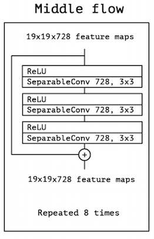
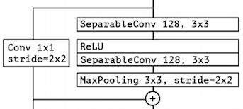
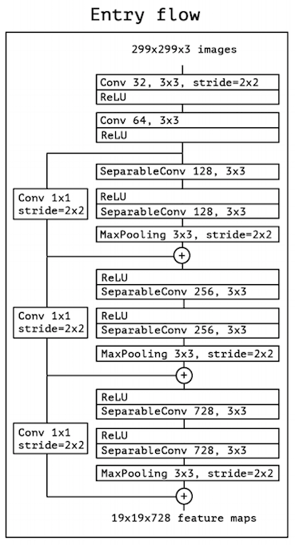
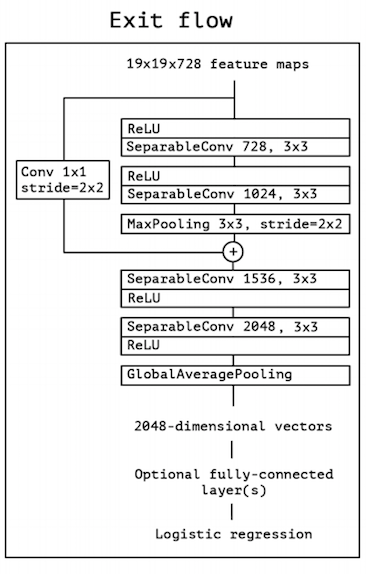

# Implementation of Xception Model

## Imports

```python
from __future__ import absolute_import
from __future__ import division
from __future__ import print_function

import tensorflow as tf
import numpy as np
```

```python
models = tf.contrib.keras.models
layers = tf.contrib.keras.layers
initializers = tf.contrib.keras.initializers
regularizers = tf.contrib.keras.regularizers
```

## Xception Model


### Convolution Block

```python
def conv_block(x, filters, block_num, conv_num, strides=(1,1)):
    name = 'block{}_conv{}_'.format(block_num, conv_num)

    # conv-BN-relu
    x = layers.Conv2D(filters, (3,3), strides=(2,2), use_bias=False, name=name)(x)
    x = layers.BatchNormalization(name=name+'bn')(x)
    x = layers.Activation('relu', name=name+'act')(x)

    return x
```

### Separable Convolution Block


```python
def separable_conv_block(x, filters, block_num, conv_num, pre_activation=None):
    name = 'block{}_sepconv{}_'.format(block_num, conv_num)

    if pre_activation is True:
        x = layers.Activation('relu', name=name+'act')(x)

    # (relu)-sepconv-BN-(relu)
    x = layers.SeparableConv2D(filters, (3,3), padding='same', use_bias=False, name=name)(x)
    x = layers.BatchNormalization(name=name+'bn')(x)

    if pre_activation is False:
        x = layers.Activation('relu', name=name+'act')(x)


    return x
```

### Middle Flow Block



```python
def middle_flow_block(x, filters, block_num):

    # middle flow

    residual = x

    x = separable_conv_block(x, filters, block_num=block_num, conv_num='1', pre_activation=True)
    x = separable_conv_block(x, filters, block_num=block_num, conv_num='2', pre_activation=True)
    x = separable_conv_block(x, filters, block_num=block_num, conv_num='3', pre_activation=True)

    return layers.add([x, residual])
```

### Xception Block



```python
def xception_block(x, filters, block_num, pre_activation=True):
    block = 'block{}_'.format(block_num)
    filter_conv1, filter_conv2 = filters

    # residual conv branch
    residual = layers.Conv2D(filter_conv2, (1, 1), strides=(2, 2),padding='same', use_bias=False)(x)
    residual = layers.BatchNormalization()(residual)

    # separable conv block
    x = separable_conv_block(x, filter_conv1, block_num=block_num, conv_num='1', pre_activation=pre_activation)
    x = separable_conv_block(x, filter_conv2, block_num=block_num, conv_num='2', pre_activation=True)

    # downsampling and merging
    x = layers.MaxPooling2D((3, 3), strides=(2, 2), padding='same', name=block+'pool')(x)

    return layers.add([x, residual])
```

## Entry Flow



```python
#===========ENTRY FLOW==============
#Block 1
x = conv_block(img_input, 32, block_num='1', conv_num='1', strides=(2,2))
x = conv_block(x, 64, block_num='1', conv_num='2')

#Block 2
x = xception_block(x, (128, 128), '2', pre_activation=False)

#Block 3
x = xception_block(x, (256, 256), '3')

#Block 4
x = xception_block(x, (728, 728), '4')
```

## Middle Flow


```python
#===========MIDDLE FLOW===============
for i in range(8):
    block_num = str(5+i)
    x = middle_flow_block(x, 728, block_num)
```

## Exit Flow



```python
#========EXIT FLOW============
#Block 13
x = xception_block(x, (728, 1024), '13') # second conv is different

# Block 14
x = separable_conv_block(x, 1536, block_num='14', conv_num='1', pre_activation=False)
x = separable_conv_block(x, 2048, block_num='14', conv_num='2', pre_activation=False)

# logistic regression
x = layers.GlobalAveragePooling2D(name='avg_pool')(x)
x = layers.Dense(classes, activation='softmax', name='predictions')(x)
```

### Full Xception Model

```python
def Xception(input_shape=(299,299,3), classes=1000):
    """Instantiates the Xception architecture.
    """

    img_input = layers.Input(shape=input_shape)

    #===========ENTRY FLOW==============
    #Block 1
    x = conv_block(img_input, 32, block_num='1', conv_num='1', strides=(2,2))
    x = conv_block(x, 64, block_num='1', conv_num='2')

    #Block 2
    x = xception_block(x, (128, 128), '2', pre_activation=False)

    #Block 3
    x = xception_block(x, (256, 256), '3')

    #Block 4
    x = xception_block(x, (728, 728), '4')


    #===========MIDDLE FLOW===============
    for i in range(8):
        block_num = str(5+i)
        x = middle_flow_block(x, 728, block_num)

    #========EXIT FLOW============
    #Block 13
    x = xception_block(x, (728, 1024), '13') # second conv is different

    # Block 14
    x = separable_conv_block(x, 1536, block_num='14', conv_num='1', pre_activation=False)
    x = separable_conv_block(x, 2048, block_num='14', conv_num='2', pre_activation=False)

    # logistic regression
    x = layers.GlobalAveragePooling2D(name='avg_pool')(x)
    x = layers.Dense(classes, activation='softmax', name='predictions')(x)

    # Create model.
    model = models.Model(inputs=img_input, outputs=x, name='xception')
    return model
```

```python
xception = Xception()
xception.summary()
```

```text
Layer (type)                     Output Shape          Param #     Connected to                     
====================================================================================================
input_1 (InputLayer)             (None, 299, 299, 3)   0                                            
____________________________________________________________________________________________________
block1_conv1_ (Conv2D)           (None, 149, 149, 32)  864         input_1[0][0]                    
____________________________________________________________________________________________________
block1_conv1_bn (BatchNormalizat (None, 149, 149, 32)  128         block1_conv1_[0][0]              
____________________________________________________________________________________________________
block1_conv1_act (Activation)    (None, 149, 149, 32)  0           block1_conv1_bn[0][0]            
____________________________________________________________________________________________________
block1_conv2_ (Conv2D)           (None, 147, 147, 64)  18432       block1_conv1_act[0][0]           
____________________________________________________________________________________________________
block1_conv2_bn (BatchNormalizat (None, 147, 147, 64)  256         block1_conv2_[0][0]              
____________________________________________________________________________________________________
block1_conv2_act (Activation)    (None, 147, 147, 64)  0           block1_conv2_bn[0][0]            
____________________________________________________________________________________________________
block2_sepconv1_act (Activation) (None, 147, 147, 64)  0           block1_conv2_act[0][0]           
____________________________________________________________________________________________________
block2_sepconv1_ (SeparableConv2 (None, 147, 147, 128) 8768        block2_sepconv1_act[0][0]        
____________________________________________________________________________________________________
block2_sepconv1_bn (BatchNormali (None, 147, 147, 128) 512         block2_sepconv1_[0][0]           
____________________________________________________________________________________________________
block2_sepconv2_act (Activation) (None, 147, 147, 128) 0           block2_sepconv1_bn[0][0]         
____________________________________________________________________________________________________
block2_sepconv2_ (SeparableConv2 (None, 147, 147, 128) 17536       block2_sepconv2_act[0][0]        
____________________________________________________________________________________________________
block2_sepconv2_bn (BatchNormali (None, 147, 147, 128) 512         block2_sepconv2_[0][0]           
____________________________________________________________________________________________________
conv2d_1 (Conv2D)                (None, 74, 74, 128)   8192        block1_conv2_act[0][0]           
____________________________________________________________________________________________________
block2_pool (MaxPooling2D)       (None, 74, 74, 128)   0           block2_sepconv2_bn[0][0]         
____________________________________________________________________________________________________
batch_normalization_1 (BatchNorm (None, 74, 74, 128)   512         conv2d_1[0][0]                   
____________________________________________________________________________________________________
add_1 (Add)                      (None, 74, 74, 128)   0           block2_pool[0][0]                
                                                                   batch_normalization_1[0][0]      
____________________________________________________________________________________________________
block3_sepconv1_act (Activation) (None, 74, 74, 128)   0           add_1[0][0]                      
____________________________________________________________________________________________________
block3_sepconv1_ (SeparableConv2 (None, 74, 74, 256)   33920       block3_sepconv1_act[0][0]        
____________________________________________________________________________________________________
block3_sepconv1_bn (BatchNormali (None, 74, 74, 256)   1024        block3_sepconv1_[0][0]           
____________________________________________________________________________________________________
block3_sepconv2_act (Activation) (None, 74, 74, 256)   0           block3_sepconv1_bn[0][0]         
____________________________________________________________________________________________________
block3_sepconv2_ (SeparableConv2 (None, 74, 74, 256)   67840       block3_sepconv2_act[0][0]        
____________________________________________________________________________________________________
block3_sepconv2_bn (BatchNormali (None, 74, 74, 256)   1024        block3_sepconv2_[0][0]           
____________________________________________________________________________________________________
conv2d_2 (Conv2D)                (None, 37, 37, 256)   32768       add_1[0][0]                      
____________________________________________________________________________________________________
block3_pool (MaxPooling2D)       (None, 37, 37, 256)   0           block3_sepconv2_bn[0][0]         
____________________________________________________________________________________________________
batch_normalization_2 (BatchNorm (None, 37, 37, 256)   1024        conv2d_2[0][0]                   
____________________________________________________________________________________________________
add_2 (Add)                      (None, 37, 37, 256)   0           block3_pool[0][0]                
                                                                   batch_normalization_2[0][0]      
____________________________________________________________________________________________________
block4_sepconv1_act (Activation) (None, 37, 37, 256)   0           add_2[0][0]                      
____________________________________________________________________________________________________
block4_sepconv1_ (SeparableConv2 (None, 37, 37, 728)   188672      block4_sepconv1_act[0][0]        
____________________________________________________________________________________________________
block4_sepconv1_bn (BatchNormali (None, 37, 37, 728)   2912        block4_sepconv1_[0][0]           
____________________________________________________________________________________________________
block4_sepconv2_act (Activation) (None, 37, 37, 728)   0           block4_sepconv1_bn[0][0]         
____________________________________________________________________________________________________
block4_sepconv2_ (SeparableConv2 (None, 37, 37, 728)   536536      block4_sepconv2_act[0][0]        
____________________________________________________________________________________________________
block4_sepconv2_bn (BatchNormali (None, 37, 37, 728)   2912        block4_sepconv2_[0][0]           
____________________________________________________________________________________________________
conv2d_3 (Conv2D)                (None, 19, 19, 728)   186368      add_2[0][0]                      
____________________________________________________________________________________________________
block4_pool (MaxPooling2D)       (None, 19, 19, 728)   0           block4_sepconv2_bn[0][0]         
____________________________________________________________________________________________________
batch_normalization_3 (BatchNorm (None, 19, 19, 728)   2912        conv2d_3[0][0]                   
____________________________________________________________________________________________________
add_3 (Add)                      (None, 19, 19, 728)   0           block4_pool[0][0]                
                                                                   batch_normalization_3[0][0]      
____________________________________________________________________________________________________
block5_sepconv1_act (Activation) (None, 19, 19, 728)   0           add_3[0][0]                      
____________________________________________________________________________________________________
block5_sepconv1_ (SeparableConv2 (None, 19, 19, 728)   536536      block5_sepconv1_act[0][0]        
____________________________________________________________________________________________________
block5_sepconv1_bn (BatchNormali (None, 19, 19, 728)   2912        block5_sepconv1_[0][0]           
____________________________________________________________________________________________________
block5_sepconv2_act (Activation) (None, 19, 19, 728)   0           block5_sepconv1_bn[0][0]         
____________________________________________________________________________________________________
block5_sepconv2_ (SeparableConv2 (None, 19, 19, 728)   536536      block5_sepconv2_act[0][0]        
____________________________________________________________________________________________________
block5_sepconv2_bn (BatchNormali (None, 19, 19, 728)   2912        block5_sepconv2_[0][0]           
____________________________________________________________________________________________________
block5_sepconv3_act (Activation) (None, 19, 19, 728)   0           block5_sepconv2_bn[0][0]         
____________________________________________________________________________________________________
block5_sepconv3_ (SeparableConv2 (None, 19, 19, 728)   536536      block5_sepconv3_act[0][0]        
____________________________________________________________________________________________________
block5_sepconv3_bn (BatchNormali (None, 19, 19, 728)   2912        block5_sepconv3_[0][0]           
____________________________________________________________________________________________________
add_4 (Add)                      (None, 19, 19, 728)   0           block5_sepconv3_bn[0][0]         
                                                                   add_3[0][0]                      
____________________________________________________________________________________________________
block6_sepconv1_act (Activation) (None, 19, 19, 728)   0           add_4[0][0]                      
____________________________________________________________________________________________________
block6_sepconv1_ (SeparableConv2 (None, 19, 19, 728)   536536      block6_sepconv1_act[0][0]        
____________________________________________________________________________________________________
block6_sepconv1_bn (BatchNormali (None, 19, 19, 728)   2912        block6_sepconv1_[0][0]           
____________________________________________________________________________________________________
block6_sepconv2_act (Activation) (None, 19, 19, 728)   0           block6_sepconv1_bn[0][0]         
____________________________________________________________________________________________________
block6_sepconv2_ (SeparableConv2 (None, 19, 19, 728)   536536      block6_sepconv2_act[0][0]        
____________________________________________________________________________________________________
block6_sepconv2_bn (BatchNormali (None, 19, 19, 728)   2912        block6_sepconv2_[0][0]           
____________________________________________________________________________________________________
block6_sepconv3_act (Activation) (None, 19, 19, 728)   0           block6_sepconv2_bn[0][0]         
____________________________________________________________________________________________________
block6_sepconv3_ (SeparableConv2 (None, 19, 19, 728)   536536      block6_sepconv3_act[0][0]        
____________________________________________________________________________________________________
block6_sepconv3_bn (BatchNormali (None, 19, 19, 728)   2912        block6_sepconv3_[0][0]           
____________________________________________________________________________________________________
add_5 (Add)                      (None, 19, 19, 728)   0           block6_sepconv3_bn[0][0]         
                                                                   add_4[0][0]                      
____________________________________________________________________________________________________
block7_sepconv1_act (Activation) (None, 19, 19, 728)   0           add_5[0][0]                      
____________________________________________________________________________________________________
block7_sepconv1_ (SeparableConv2 (None, 19, 19, 728)   536536      block7_sepconv1_act[0][0]        
____________________________________________________________________________________________________
block7_sepconv1_bn (BatchNormali (None, 19, 19, 728)   2912        block7_sepconv1_[0][0]           
____________________________________________________________________________________________________
block7_sepconv2_act (Activation) (None, 19, 19, 728)   0           block7_sepconv1_bn[0][0]         
____________________________________________________________________________________________________
block7_sepconv2_ (SeparableConv2 (None, 19, 19, 728)   536536      block7_sepconv2_act[0][0]        
____________________________________________________________________________________________________
block7_sepconv2_bn (BatchNormali (None, 19, 19, 728)   2912        block7_sepconv2_[0][0]           
____________________________________________________________________________________________________
block7_sepconv3_act (Activation) (None, 19, 19, 728)   0           block7_sepconv2_bn[0][0]         
____________________________________________________________________________________________________
block7_sepconv3_ (SeparableConv2 (None, 19, 19, 728)   536536      block7_sepconv3_act[0][0]        
____________________________________________________________________________________________________
block7_sepconv3_bn (BatchNormali (None, 19, 19, 728)   2912        block7_sepconv3_[0][0]           
____________________________________________________________________________________________________
add_6 (Add)                      (None, 19, 19, 728)   0           block7_sepconv3_bn[0][0]         
                                                                   add_5[0][0]                      
____________________________________________________________________________________________________
block8_sepconv1_act (Activation) (None, 19, 19, 728)   0           add_6[0][0]                      
____________________________________________________________________________________________________
block8_sepconv1_ (SeparableConv2 (None, 19, 19, 728)   536536      block8_sepconv1_act[0][0]        
____________________________________________________________________________________________________
block8_sepconv1_bn (BatchNormali (None, 19, 19, 728)   2912        block8_sepconv1_[0][0]           
____________________________________________________________________________________________________
block8_sepconv2_act (Activation) (None, 19, 19, 728)   0           block8_sepconv1_bn[0][0]         
____________________________________________________________________________________________________
block8_sepconv2_ (SeparableConv2 (None, 19, 19, 728)   536536      block8_sepconv2_act[0][0]        
____________________________________________________________________________________________________
block8_sepconv2_bn (BatchNormali (None, 19, 19, 728)   2912        block8_sepconv2_[0][0]           
____________________________________________________________________________________________________
block8_sepconv3_act (Activation) (None, 19, 19, 728)   0           block8_sepconv2_bn[0][0]         
____________________________________________________________________________________________________
block8_sepconv3_ (SeparableConv2 (None, 19, 19, 728)   536536      block8_sepconv3_act[0][0]        
____________________________________________________________________________________________________
block8_sepconv3_bn (BatchNormali (None, 19, 19, 728)   2912        block8_sepconv3_[0][0]           
____________________________________________________________________________________________________
add_7 (Add)                      (None, 19, 19, 728)   0           block8_sepconv3_bn[0][0]         
                                                                   add_6[0][0]                      
____________________________________________________________________________________________________
block9_sepconv1_act (Activation) (None, 19, 19, 728)   0           add_7[0][0]                      
____________________________________________________________________________________________________
block9_sepconv1_ (SeparableConv2 (None, 19, 19, 728)   536536      block9_sepconv1_act[0][0]        
____________________________________________________________________________________________________
block9_sepconv1_bn (BatchNormali (None, 19, 19, 728)   2912        block9_sepconv1_[0][0]           
____________________________________________________________________________________________________
block9_sepconv2_act (Activation) (None, 19, 19, 728)   0           block9_sepconv1_bn[0][0]         
____________________________________________________________________________________________________
block9_sepconv2_ (SeparableConv2 (None, 19, 19, 728)   536536      block9_sepconv2_act[0][0]        
____________________________________________________________________________________________________
block9_sepconv2_bn (BatchNormali (None, 19, 19, 728)   2912        block9_sepconv2_[0][0]           
____________________________________________________________________________________________________
block9_sepconv3_act (Activation) (None, 19, 19, 728)   0           block9_sepconv2_bn[0][0]         
____________________________________________________________________________________________________
block9_sepconv3_ (SeparableConv2 (None, 19, 19, 728)   536536      block9_sepconv3_act[0][0]        
____________________________________________________________________________________________________
block9_sepconv3_bn (BatchNormali (None, 19, 19, 728)   2912        block9_sepconv3_[0][0]           
____________________________________________________________________________________________________
add_8 (Add)                      (None, 19, 19, 728)   0           block9_sepconv3_bn[0][0]         
                                                                   add_7[0][0]                      
____________________________________________________________________________________________________
block10_sepconv1_act (Activation (None, 19, 19, 728)   0           add_8[0][0]                      
____________________________________________________________________________________________________
block10_sepconv1_ (SeparableConv (None, 19, 19, 728)   536536      block10_sepconv1_act[0][0]       
____________________________________________________________________________________________________
block10_sepconv1_bn (BatchNormal (None, 19, 19, 728)   2912        block10_sepconv1_[0][0]          
____________________________________________________________________________________________________
block10_sepconv2_act (Activation (None, 19, 19, 728)   0           block10_sepconv1_bn[0][0]        
____________________________________________________________________________________________________
block10_sepconv2_ (SeparableConv (None, 19, 19, 728)   536536      block10_sepconv2_act[0][0]       
____________________________________________________________________________________________________
block10_sepconv2_bn (BatchNormal (None, 19, 19, 728)   2912        block10_sepconv2_[0][0]          
____________________________________________________________________________________________________
block10_sepconv3_act (Activation (None, 19, 19, 728)   0           block10_sepconv2_bn[0][0]        
____________________________________________________________________________________________________
block10_sepconv3_ (SeparableConv (None, 19, 19, 728)   536536      block10_sepconv3_act[0][0]       
____________________________________________________________________________________________________
block10_sepconv3_bn (BatchNormal (None, 19, 19, 728)   2912        block10_sepconv3_[0][0]          
____________________________________________________________________________________________________
add_9 (Add)                      (None, 19, 19, 728)   0           block10_sepconv3_bn[0][0]        
                                                                   add_8[0][0]                      
____________________________________________________________________________________________________
block11_sepconv1_act (Activation (None, 19, 19, 728)   0           add_9[0][0]                      
____________________________________________________________________________________________________
block11_sepconv1_ (SeparableConv (None, 19, 19, 728)   536536      block11_sepconv1_act[0][0]       
____________________________________________________________________________________________________
block11_sepconv1_bn (BatchNormal (None, 19, 19, 728)   2912        block11_sepconv1_[0][0]          
____________________________________________________________________________________________________
block11_sepconv2_act (Activation (None, 19, 19, 728)   0           block11_sepconv1_bn[0][0]        
____________________________________________________________________________________________________
block11_sepconv2_ (SeparableConv (None, 19, 19, 728)   536536      block11_sepconv2_act[0][0]       
____________________________________________________________________________________________________
block11_sepconv2_bn (BatchNormal (None, 19, 19, 728)   2912        block11_sepconv2_[0][0]          
____________________________________________________________________________________________________
block11_sepconv3_act (Activation (None, 19, 19, 728)   0           block11_sepconv2_bn[0][0]        
____________________________________________________________________________________________________
block11_sepconv3_ (SeparableConv (None, 19, 19, 728)   536536      block11_sepconv3_act[0][0]       
____________________________________________________________________________________________________
block11_sepconv3_bn (BatchNormal (None, 19, 19, 728)   2912        block11_sepconv3_[0][0]          
____________________________________________________________________________________________________
add_10 (Add)                     (None, 19, 19, 728)   0           block11_sepconv3_bn[0][0]        
                                                                   add_9[0][0]                      
____________________________________________________________________________________________________
block12_sepconv1_act (Activation (None, 19, 19, 728)   0           add_10[0][0]                     
____________________________________________________________________________________________________
block12_sepconv1_ (SeparableConv (None, 19, 19, 728)   536536      block12_sepconv1_act[0][0]       
____________________________________________________________________________________________________
block12_sepconv1_bn (BatchNormal (None, 19, 19, 728)   2912        block12_sepconv1_[0][0]          
____________________________________________________________________________________________________
block12_sepconv2_act (Activation (None, 19, 19, 728)   0           block12_sepconv1_bn[0][0]        
____________________________________________________________________________________________________
block12_sepconv2_ (SeparableConv (None, 19, 19, 728)   536536      block12_sepconv2_act[0][0]       
____________________________________________________________________________________________________
block12_sepconv2_bn (BatchNormal (None, 19, 19, 728)   2912        block12_sepconv2_[0][0]          
____________________________________________________________________________________________________
block12_sepconv3_act (Activation (None, 19, 19, 728)   0           block12_sepconv2_bn[0][0]        
____________________________________________________________________________________________________
block12_sepconv3_ (SeparableConv (None, 19, 19, 728)   536536      block12_sepconv3_act[0][0]       
____________________________________________________________________________________________________
block12_sepconv3_bn (BatchNormal (None, 19, 19, 728)   2912        block12_sepconv3_[0][0]          
____________________________________________________________________________________________________
add_11 (Add)                     (None, 19, 19, 728)   0           block12_sepconv3_bn[0][0]        
                                                                   add_10[0][0]                     
____________________________________________________________________________________________________
block13_sepconv1_act (Activation (None, 19, 19, 728)   0           add_11[0][0]                     
____________________________________________________________________________________________________
block13_sepconv1_ (SeparableConv (None, 19, 19, 728)   536536      block13_sepconv1_act[0][0]       
____________________________________________________________________________________________________
block13_sepconv1_bn (BatchNormal (None, 19, 19, 728)   2912        block13_sepconv1_[0][0]          
____________________________________________________________________________________________________
block13_sepconv2_act (Activation (None, 19, 19, 728)   0           block13_sepconv1_bn[0][0]        
____________________________________________________________________________________________________
block13_sepconv2_ (SeparableConv (None, 19, 19, 1024)  752024      block13_sepconv2_act[0][0]       
____________________________________________________________________________________________________
block13_sepconv2_bn (BatchNormal (None, 19, 19, 1024)  4096        block13_sepconv2_[0][0]          
____________________________________________________________________________________________________
conv2d_4 (Conv2D)                (None, 10, 10, 1024)  745472      add_11[0][0]                     
____________________________________________________________________________________________________
block13_pool (MaxPooling2D)      (None, 10, 10, 1024)  0           block13_sepconv2_bn[0][0]        
____________________________________________________________________________________________________
batch_normalization_4 (BatchNorm (None, 10, 10, 1024)  4096        conv2d_4[0][0]                   
____________________________________________________________________________________________________
add_12 (Add)                     (None, 10, 10, 1024)  0           block13_pool[0][0]               
                                                                   batch_normalization_4[0][0]      
____________________________________________________________________________________________________
block14_sepconv1_ (SeparableConv (None, 10, 10, 1536)  1582080     add_12[0][0]                     
____________________________________________________________________________________________________
block14_sepconv1_bn (BatchNormal (None, 10, 10, 1536)  6144        block14_sepconv1_[0][0]          
____________________________________________________________________________________________________
block14_sepconv1_act (Activation (None, 10, 10, 1536)  0           block14_sepconv1_bn[0][0]        
____________________________________________________________________________________________________
block14_sepconv2_ (SeparableConv (None, 10, 10, 2048)  3159552     block14_sepconv1_act[0][0]       
____________________________________________________________________________________________________
block14_sepconv2_bn (BatchNormal (None, 10, 10, 2048)  8192        block14_sepconv2_[0][0]          
____________________________________________________________________________________________________
block14_sepconv2_act (Activation (None, 10, 10, 2048)  0           block14_sepconv2_bn[0][0]        
____________________________________________________________________________________________________
avg_pool (GlobalAveragePooling2D (None, 2048)          0           block14_sepconv2_act[0][0]       
____________________________________________________________________________________________________
predictions (Dense)              (None, 1000)          2049000     avg_pool[0][0]                   
====================================================================================================
Total params: 22,910,480
Trainable params: 22,855,952
Non-trainable params: 54,528
____________________________________________________________________________________________________
```

### Next Lesson

#### Train and Evaluate Xception

* Image classification task with ImageNet dataset


