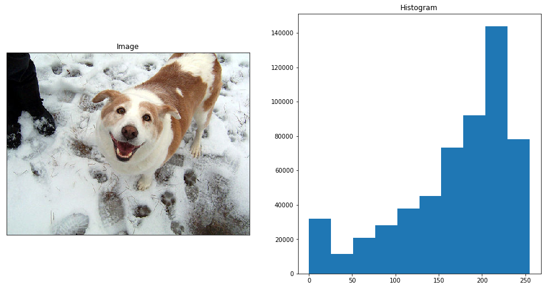
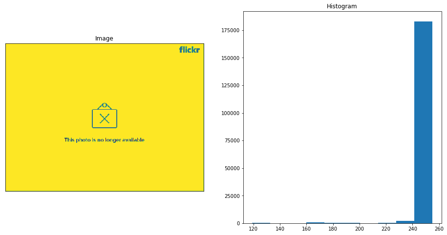
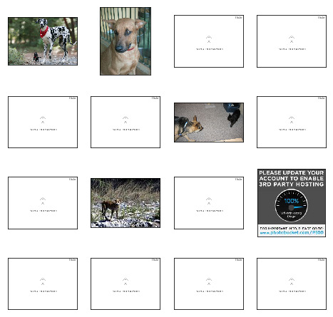
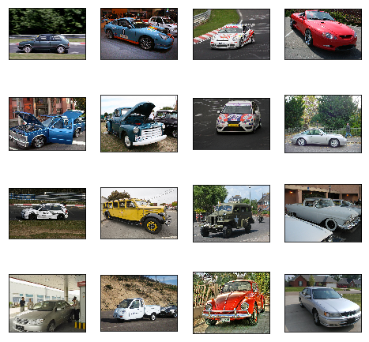
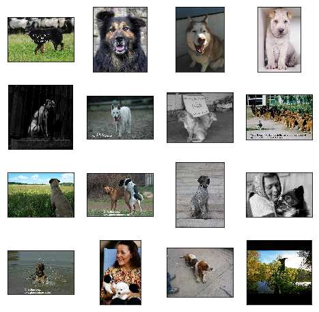
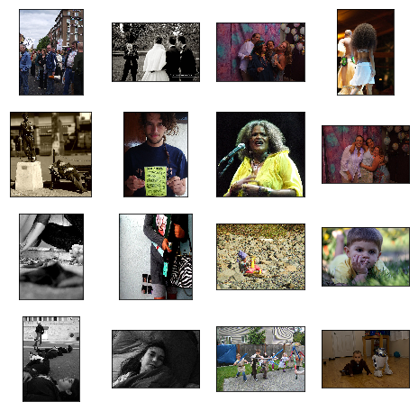
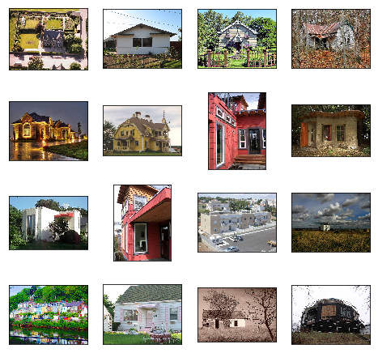

# Load and Explore the ImageNet Dataset

## Image Classification Task

ImageNet is a famous computer-vision dataset used for object recognition.

The dataset consists of:

* colored images of various sizes
* 1000 classes


## Imports

```python
from __future__ import absolute_import
from __future__ import division
from __future__ import print_function

import os
from PIL import Image
import numpy as np
from scipy import misc
import random
import shutil
import matplotlib
import matplotlib.pyplot as plt

import tensorflow as tf
```

## Download ImageNet Images

**Clone** [**ImageNet\_Utils**](https://github.com/tzutalin/ImageNet_Utils) **repository**

```text
git clone git@github.com:tzutalin/ImageNet_Utils.git
```

**Download Images given wnid**

```text
cd ImageNet_Utils
./downloadutils.py --downloadImages --wnid n02472987
```

```python
classes = {"dog":"n02084071",
           "human": "n02472987",
           "car": "n02958343",
           "house": "n03544360"}
```

```python
BASE_DIR = "/Users/marvinbertin/GitHub/marvin/ImageNet_Utils"
get_class_path = lambda name: os.path.join(BASE_DIR, classes[name], "{}_urlimages".format(classes[name]))
```

## Plot Image Pixel Distribution

```python
def plot_pixel_distribution(img_file):
    # load image
    img = misc.imread(img_file)

    # figure size
    fig = plt.figure(figsize=(16, 8))

    # plot image
    fig.add_subplot(1, 2, 1)
    plt.title("Image")
    plt.imshow(img)
    plt.xticks(np.array([]))
    plt.yticks(np.array([]))

    # plot hitogram
    fig.add_subplot(1, 2, 2)
    plt.title("Histogram")
    plt.hist(img.flatten())

    plt.show()
```

## Example of Good Image

```python
g_image = "2800688_afe83c164a.jpg"
plot_pixel_distribution(os.path.join(get_class_path("dog"), g_image))
```



## Example of Bad Image

```python
b_image = "1824736_a744fd42ee.jpg"
plot_pixel_distribution(os.path.join(get_class_path("dog"), b_image))
```



## Filter Bad Images

```python
def filtered_images(images):

    good_images = []
    bad_images = []
    for filename in images:
        try:
            img = Image.open(filename)
            # pixel distribution
            v = img.histogram()
            h, w = img.size
            percentage_monochrome = max(v) / float(h*w)

            # filter bad and small images
            if percentage_monochrome > 0.8 or h < 300 or w <300:
                bad_images.append(filename)
            else:
                good_images.append(filename)
        except:
            pass

    print("Number of good images: {}\n".format(len(good_images)))
    print("Number of bad images: {}\n".format(len(bad_images)))
    return good_images, bad_images
```

## Filter Dog Images

```python
class_dir = get_class_path("dog")
dog_images = map(lambda f: os.path.join(class_dir, f), os.listdir(class_dir))

# filter dog images
g_images, b_images = filtered_images(dog_images)
```

```text
Number of good images: 771

Number of bad images: 178
```

## Plot Bad Images

```python
def plot_image_grid(images_files):
    # figure size
    fig = plt.figure(figsize=(8, 8))

    # load images
    images = [tf.contrib.keras.preprocessing.image.load_img(img) for img in images_files]

    # plot image grid
    for x in range(4):
        for y in range(4):
            ax = fig.add_subplot(4, 4, 4*y+x+1)
            plt.imshow(images[4*y+x])
            plt.xticks(np.array([]))
            plt.yticks(np.array([]))
    plt.show()
```

```python
# plot bad images
plot_image_grid(b_images[:16])
```



## Filter and Explore Every Classes

```python
data_dic = {}
for class_name, wind_number in classes.iteritems():

    print("Class Name: {}\n".format(class_name))
    class_dir = get_class_path(class_name)
    class_images = map(lambda f: os.path.join(class_dir, f), os.listdir(class_dir))

    g_images, b_images = filtered_images(class_images)

    random.shuffle(g_images)
    data_dic[class_name] = g_images

    plot_image_grid(g_images[:16])
```

```text
Class Name: car

Number of good images: 791

Number of bad images: 201
```



```text
Class Name: dog

Number of good images: 771

Number of bad images: 178
```



```text
Class Name: human

Number of good images: 1226

Number of bad images: 249
```



```text
Class Name: house

Number of good images: 564

Number of bad images: 174
```



## Split Into Train and Validation Sets

```python
# Create new directory and copy files to it
def copy_files_to_directory(files, directory):
    if not os.path.exists(directory):
        os.makedirs(directory)
        print("Created directory: {}".format(directory))

    for f in files:
        shutil.copy(f, directory)
    print("Copied {} files.\n".format(len(files)))
```

```python
def train_validation_split(base_dir, data_dic, split_ratio=0.2):
    IMAGENET_DATASET = os.path.join(base_dir,"imageNet_dataset")

    if not os.path.exists(IMAGENET_DATASET):
        os.makedirs(IMAGENET_DATASET)

    for class_name, imgs in data_dic.iteritems():
        idx_split = int(len(imgs) * split_ratio)
        random.shuffle(imgs)
        validation = imgs[:idx_split]
        train = imgs[idx_split:]

        copy_files_to_directory(train, os.path.join(IMAGENET_DATASET,"train",class_name))
        copy_files_to_directory(validation, os.path.join(IMAGENET_DATASET,"validation",class_name))
```

```python
# split data into train and validation
train_validation_split(BASE_DIR, data_dic, split_ratio=0.2)
```

```text
Created directory: /Users/marvinbertin/GitHub/marvin/ImageNet_Utils/imageNet_dataset/train/car
Copied 633 files.

Created directory: /Users/marvinbertin/GitHub/marvin/ImageNet_Utils/imageNet_dataset/validation/car
Copied 158 files.

Created directory: /Users/marvinbertin/GitHub/marvin/ImageNet_Utils/imageNet_dataset/train/dog
Copied 617 files.

Created directory: /Users/marvinbertin/GitHub/marvin/ImageNet_Utils/imageNet_dataset/validation/dog
Copied 154 files.

Created directory: /Users/marvinbertin/GitHub/marvin/ImageNet_Utils/imageNet_dataset/train/human
Copied 981 files.

Created directory: /Users/marvinbertin/GitHub/marvin/ImageNet_Utils/imageNet_dataset/validation/human
Copied 245 files.

Created directory: /Users/marvinbertin/GitHub/marvin/ImageNet_Utils/imageNet_dataset/train/house
Copied 452 files.

Created directory: /Users/marvinbertin/GitHub/marvin/ImageNet_Utils/imageNet_dataset/validation/house
Copied 112 files.
```

## Final Directory Structure

```text
.
├── train
│   ├── car
│   ├── dog
│   ├── house
│   └── human
└── validation
    ├── car
    ├── dog
    ├── house
    └── human
```

### Next Lesson

#### Xception Architecture

* Inception module
* Depthwise Separable Convolutions


