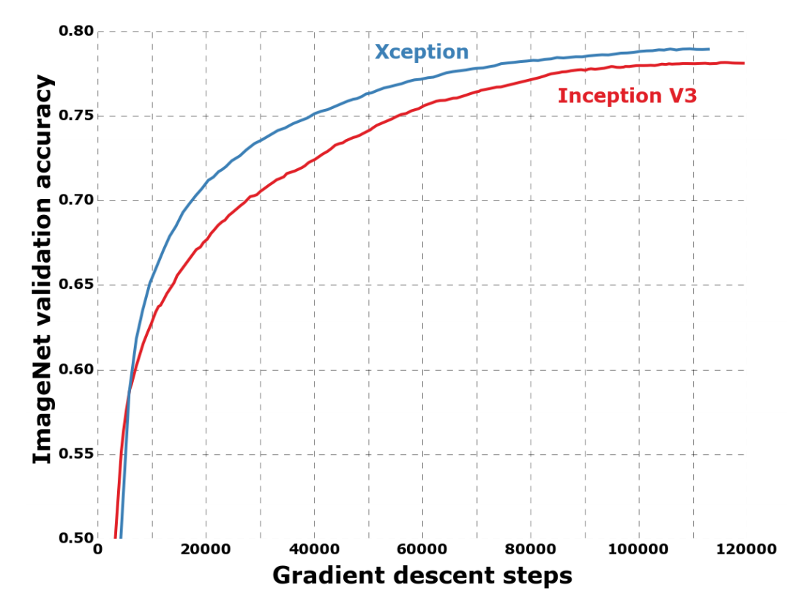
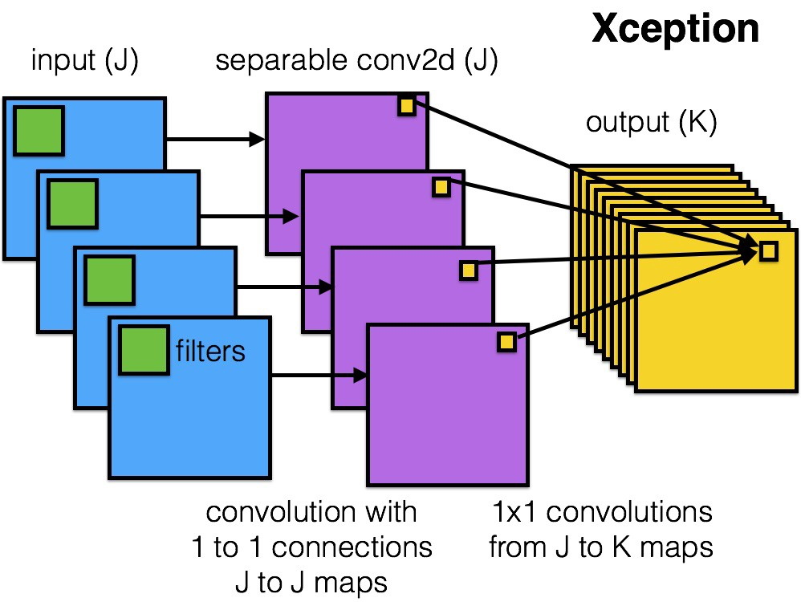
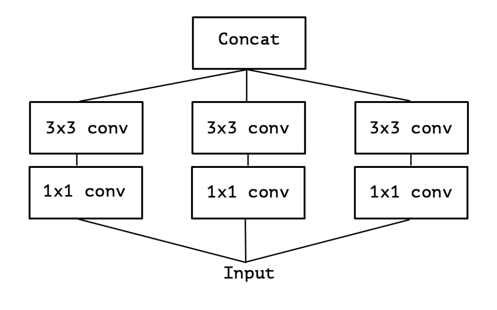
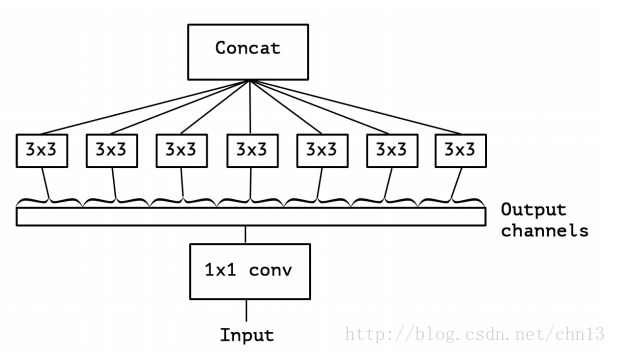
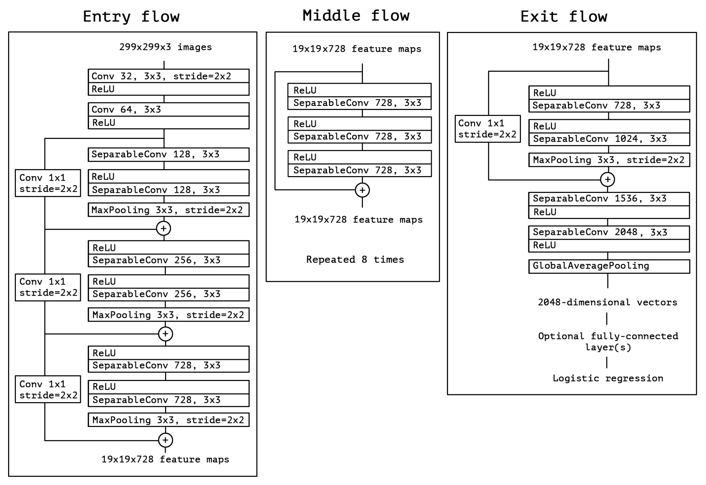

# Xception Architectural Design

## Xception model

* Inspired by Google's Inception model
* Xception is based on an 'extreme' interpretation of the Inception model
* The Xception architecture is a linear stack of depthwise separable convolution layers with residual connections
* Simple and modular architecture

## Depthwise Separable Convolution

**Regular Convolutions:**

* look at both channel & spatial correlations simultaneously

**Depthwise separable convolution:**

* look at channel & spatial correlations independently in successive steps
* spatial convolution: 3x3 convolutions for each channel
* depthwise convolution: 1x1 convolutions on concatenated channels

**Example:** take 3x3 convolutional layer on 16 input channels and 32 output channels.

* regular convolution: 16x32x3x3 = 4608 parameters
* depthwise separable convolution: \(spatial conv + depthwise conv\) = \(16x3x3 + 16x32x1x1\) = 656 parameters
* greatly reduced parameter count
* more efficient complexity
* maintains cross-channel features

## Inception Model

* fundamental hypothesis: cross-channel correlations and spatial correlations are sufficiently decoupled
* first looks at crosschannel correlations via a set of 1x1 convolutions.
* then acts as a “multi-level feature extractor” by computing 1×1, 3×3, and 5×5 convolutions
* output feature maps are stacked along the channel dimension

**“extreme” version of Inception module:**

* first use a 1x1 convolution to map cross-channel correlations
* then separately map the spatial correlations of every output channel \(instead of just 3-4 partitions\)
* Similar to depthwise separable convolution

## What makes depthwise separable convolution different

Two differences between and “extreme” version of an Inception module and a depthwise separable convolution

1. The order of the operations:
   * depthwise separable convolutions perform first channel-wise spatial convolution and then perform 1x1 depthwise convolution on the output.
2. Non-linearity after the first operation:
   * In Inception both operations are followed by a ReLU non-linearity
   * In depthwise separable convolutions don't have intermediate non-linearities

## Xception architecture

* convolutional neural network architecture based entirely on depthwise separable convolution layers.
* fundamental hypothesis: mapping of cross-channels correlations and spatial correlations can be entirely decoupled.
* composed of 36 convolutional layers forming the feature extraction base of the network
* structured into 14 modules, all of which have linear residual connections around them, except for the first and last modules.

### Next Lesson

#### Implementation of Xception model

* depthwise separable convolution

