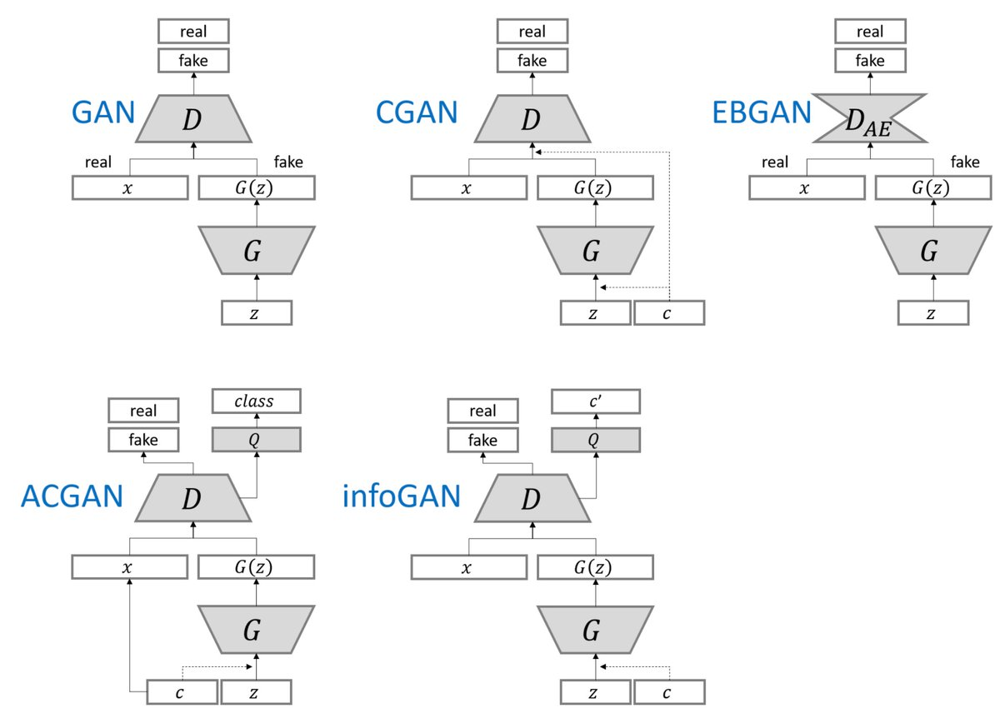
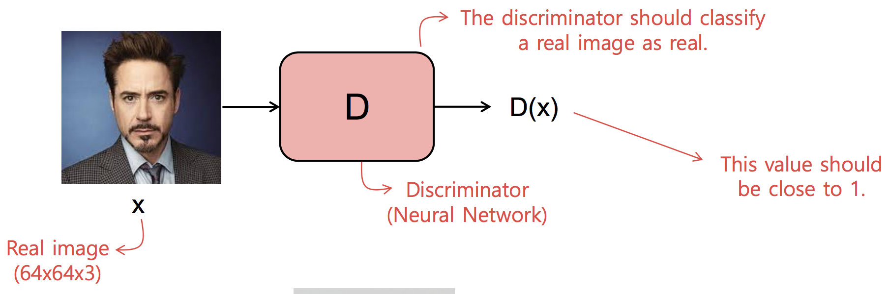
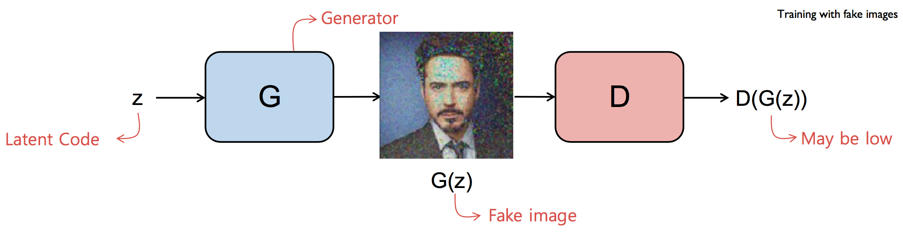
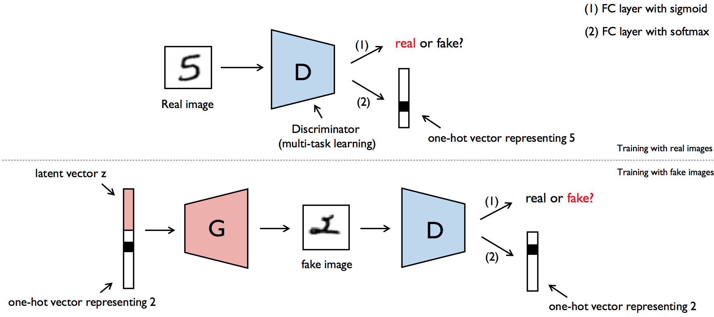

# ACGAN Architectural Design

## ACGAN Model

[Conditional Image Synthesis with Auxiliary Classifier GANs paper](https://arxiv.org/pdf/1610.09585.pdf)

* CNN have brought advances in image classification
* CNN can also be reversed to generate images from scratch \(generative models\)
* One type of generative model are generative adversarial networks \(GANs\)
* Special type of GAN is Auxiliary Classifier GANs \(ACGAN\)
* GAN with class-label conditioning to generate images

### Example of Generated Images Conditioned on Label

## Introduction to Generative Adversarial Networks \(GANs\)

* GAN is composed of two competing neural network models \(often CNNs\)
* **Generator:**  takes noise input and generate a realistic image
* **Discriminator:**  takes real and fake images and has to distinguish the fake from the real
* Two networks play an adversarial game
* generator learns to produce more and more realistic samples
* discriminator learns to get better and better at distinguishing generated data from real data.
* networks are trained simultaneously

 **Training on real image:** 

* Discriminator should classify real image as real
* Ouput probability close to 1

 **Training on fake image:** 

* Generator generate fake image from noise
* Discriminator should classify fake image as fake
* Ouput probability close to 0

## Auxiliary Classifier ACGAN

Proposed a new method for improved training of GANs by conditioning input with class labels.

**Multi-input multi-output network:**

* **Inputs:** class embedding and noise vector
* **Outputs:** binary classifier \(fake/real images\) and multi-class classifier \(image classes\)

### Next Lesson

#### Implementation of ACGAN model

* Generator
* Discriminator
* dual loss functions

