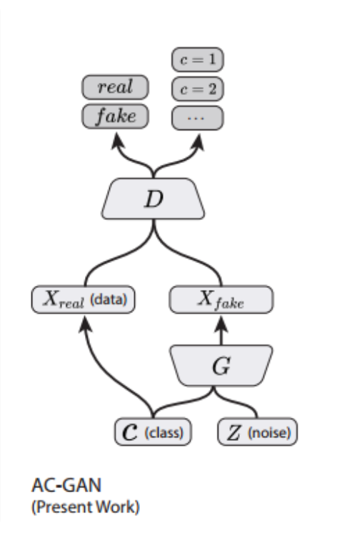

# Implementation of ACGAN Model

## Imports

```python
from __future__ import absolute_import
from __future__ import division
from __future__ import print_function

import tensorflow as tf
import numpy as np
```

```python
models = tf.contrib.keras.models
layers = tf.contrib.keras.layers
utils = tf.contrib.keras.utils
losses = tf.contrib.keras.losses
optimizers = tf.contrib.keras.optimizers 
metrics = tf.contrib.keras.metrics
```

## Construct Generator


```python
def generator(latent_size, classes=10):

    def up_sampling_block(x, filter_size):
        # upsample block
        x = layers.UpSampling2D(size=(2,2))(x)
        x = layers.Conv2D(filter_size, (5,5), padding='same', activation='relu')(x)

        return x

    # Input 1
    # image class label
    image_class = layers.Input(shape=(1,), dtype='int32', name='image_class')

    # class embeddings
    emb = layers.Embedding(classes, latent_size,
                           embeddings_initializer='glorot_normal')(image_class)

    # 10 classes in MNIST
    cls = layers.Flatten()(emb)

    # Input 2
    # latent noise vector
    latent_input = layers.Input(shape=(latent_size,), name='latent_noise')

    # hadamard product between latent embedding and a class conditional embedding
    h = layers.multiply([latent_input, cls])

    # Conv generator
    x = layers.Dense(1024, activation='relu')(h)
    x = layers.Dense(128 * 7 * 7, activation='relu')(x)
    x = layers.Reshape((7, 7, 128))(x)

    # upsample to (14, 14, 128)
    x = up_sampling_block(x, 128)

    # upsample to (28, 28, 256)
    x = up_sampling_block(x, 256)

    # reduce channel into binary image (28, 28, 1)
    generated_img = layers.Conv2D(1, (2,2), padding='same', activation='tanh')(x)

    return models.Model(inputs=[latent_input, image_class],
                        outputs=generated_img,
                        name='generator')
```

```python
g = generator(latent_size = 100, classes=10)
g.summary()
```

```text
Layer (type)                     Output Shape          Param #     Connected to                     
====================================================================================================
image_class (InputLayer)         (None, 1)             0                                            
____________________________________________________________________________________________________
embedding_6 (Embedding)          (None, 1, 100)        1000        image_class[0][0]                
____________________________________________________________________________________________________
latent_noise (InputLayer)        (None, 100)           0                                            
____________________________________________________________________________________________________
flatten_10 (Flatten)             (None, 100)           0           embedding_6[0][0]                
____________________________________________________________________________________________________
multiply_6 (Multiply)            (None, 100)           0           latent_noise[0][0]               
                                                                   flatten_10[0][0]                 
____________________________________________________________________________________________________
dense_11 (Dense)                 (None, 1024)          103424      multiply_6[0][0]                 
____________________________________________________________________________________________________
dense_12 (Dense)                 (None, 6272)          6428800     dense_11[0][0]                   
____________________________________________________________________________________________________
reshape_6 (Reshape)              (None, 7, 7, 128)     0           dense_12[0][0]                   
____________________________________________________________________________________________________
up_sampling2d_11 (UpSampling2D)  (None, 14, 14, 128)   0           reshape_6[0][0]                  
____________________________________________________________________________________________________
conv2d_32 (Conv2D)               (None, 14, 14, 256)   819456      up_sampling2d_11[0][0]           
____________________________________________________________________________________________________
up_sampling2d_12 (UpSampling2D)  (None, 28, 28, 256)   0           conv2d_32[0][0]                  
____________________________________________________________________________________________________
conv2d_33 (Conv2D)               (None, 28, 28, 128)   819328      up_sampling2d_12[0][0]           
____________________________________________________________________________________________________
conv2d_34 (Conv2D)               (None, 28, 28, 1)     513         conv2d_33[0][0]                  
====================================================================================================
Total params: 8,172,521
Trainable params: 8,172,521
Non-trainable params: 0
____________________________________________________________________________________________________
```

## Construct Discriminator


```python
def discriminator(input_shape=(28, 28, 1)):

    def conv_block(x, filter_size, stride):

        x = layers.Conv2D(filter_size, (3,3), padding='same', strides=stride)(x)
        x = layers.LeakyReLU()(x)
        x = layers.Dropout(0.3)(x)
        return x

    input_img = layers.Input(shape=input_shape)

    # discriminator network
    x = conv_block(input_img, 32, (2,2))
    x = conv_block(input_img, 64, (1,1))
    x = conv_block(input_img, 128, (2,2))
    x = conv_block(input_img, 256, (1,1))

    features = layers.Flatten()(x)

    # binary classifier, image fake or real
    fake = layers.Dense(1, activation='sigmoid', name='generation')(features)

    # multi-class classifier, image digit class
    aux = layers.Dense(10, activation='softmax', name='auxiliary')(features)


    return models.Model(inputs=input_img, outputs=[fake, aux], name='discriminator')
```

```python
d = discriminator(input_shape=(28, 28, 1))
d.summary()
```

```text
Layer (type)                     Output Shape          Param #     Connected to                     
====================================================================================================
input_6 (InputLayer)             (None, 28, 28, 1)     0                                            
____________________________________________________________________________________________________
conv2d_35 (Conv2D)               (None, 14, 14, 32)    320         input_6[0][0]                    
____________________________________________________________________________________________________
leaky_re_lu_17 (LeakyReLU)       (None, 14, 14, 32)    0           conv2d_35[0][0]                  
____________________________________________________________________________________________________
dropout_17 (Dropout)             (None, 14, 14, 32)    0           leaky_re_lu_17[0][0]             
____________________________________________________________________________________________________
conv2d_36 (Conv2D)               (None, 14, 14, 64)    18496       dropout_17[0][0]                 
____________________________________________________________________________________________________
leaky_re_lu_18 (LeakyReLU)       (None, 14, 14, 64)    0           conv2d_36[0][0]                  
____________________________________________________________________________________________________
dropout_18 (Dropout)             (None, 14, 14, 64)    0           leaky_re_lu_18[0][0]             
____________________________________________________________________________________________________
conv2d_37 (Conv2D)               (None, 7, 7, 128)     73856       dropout_18[0][0]                 
____________________________________________________________________________________________________
leaky_re_lu_19 (LeakyReLU)       (None, 7, 7, 128)     0           conv2d_37[0][0]                  
____________________________________________________________________________________________________
dropout_19 (Dropout)             (None, 7, 7, 128)     0           leaky_re_lu_19[0][0]             
____________________________________________________________________________________________________
conv2d_38 (Conv2D)               (None, 7, 7, 256)     295168      dropout_19[0][0]                 
____________________________________________________________________________________________________
leaky_re_lu_20 (LeakyReLU)       (None, 7, 7, 256)     0           conv2d_38[0][0]                  
____________________________________________________________________________________________________
dropout_20 (Dropout)             (None, 7, 7, 256)     0           leaky_re_lu_20[0][0]             
____________________________________________________________________________________________________
flatten_11 (Flatten)             (None, 12544)         0           dropout_20[0][0]                 
____________________________________________________________________________________________________
generation (Dense)               (None, 1)             12545       flatten_11[0][0]                 
____________________________________________________________________________________________________
auxiliary (Dense)                (None, 10)            125450      flatten_11[0][0]                 
====================================================================================================
Total params: 525,835
Trainable params: 525,835
Non-trainable params: 0
____________________________________________________________________________________________________
```

## Combine Generator with Discriminator



```python
# Adam parameters suggested in paper
adam_lr = 0.0002
adam_beta_1 = 0.5

def ACGAN(latent_size = 100):
    # build the discriminator
    dis = discriminator()
    dis.compile(
        optimizer=optimizers.Adam(lr=adam_lr, beta_1=adam_beta_1),
        loss=['binary_crossentropy', 'sparse_categorical_crossentropy']
    )

    # build the generator
    gen = generator(latent_size)
    gen.compile(optimizer=optimizers.Adam(lr=adam_lr, beta_1=adam_beta_1),
                      loss='binary_crossentropy')

    # Inputs
    latent = layers.Input(shape=(latent_size, ), name='latent_noise')
    image_class = layers.Input(shape=(1,), dtype='int32', name='image_class')

    # Get a fake image
    fake_img = gen([latent, image_class])

    # Only train generator in combined model
    dis.trainable = False
    fake, aux = dis(fake_img)
    combined = models.Model(inputs=[latent, image_class],
                            outputs=[fake, aux],
                            name='ACGAN')

    combined.compile(
        optimizer=optimizers.Adam(lr=adam_lr, beta_1=adam_beta_1),
        loss=['binary_crossentropy', 'sparse_categorical_crossentropy']
    )

    return combined
```

```python
cagan = ACGAN(latent_size = 100)
cagan.summary()
```

```text
Layer (type)                     Output Shape          Param #     Connected to                     
====================================================================================================
latent_noise (InputLayer)        (None, 100)           0                                            
____________________________________________________________________________________________________
image_class (InputLayer)         (None, 1)             0                                            
____________________________________________________________________________________________________
generator (Model)                (None, 28, 28, 1)     8172521     latent_noise[0][0]               
                                                                   image_class[0][0]                
____________________________________________________________________________________________________
discriminator (Model)            [(None, 1), (None, 10 525835      generator[1][0]                  
====================================================================================================
Total params: 8,698,356
Trainable params: 8,172,521
Non-trainable params: 525,835
____________________________________________________________________________________________________
```

### Next Lesson

#### Train and Evaluate ACGAN

* Image classification task with MNIST

