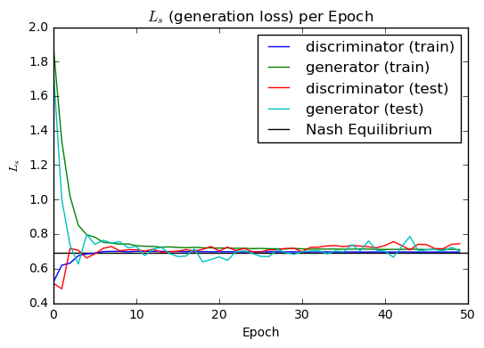
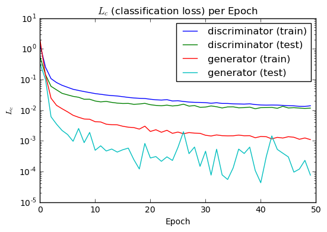
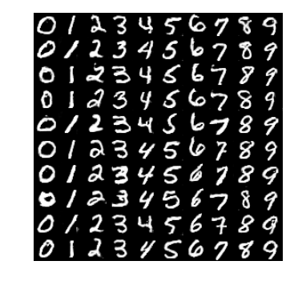

# Training and Evaluating ACGAN Model

## Imports

```python
from __future__ import absolute_import
from __future__ import division
from __future__ import print_function

import tensorflow as tf
import numpy as np
from collections import defaultdict
import cPickle as pickle
import matplotlib.pyplot as plt
import pandas as pd
from PIL import Image
from six.moves import range
from glob import glob
```

```python
models = tf.contrib.keras.models
layers = tf.contrib.keras.layers
utils = tf.contrib.keras.utils
losses = tf.contrib.keras.losses
optimizers = tf.contrib.keras.optimizers 
metrics = tf.contrib.keras.metrics
preprocessing_image = tf.contrib.keras.preprocessing.image
datasets = tf.contrib.keras.datasets
```

## Construct Generator

```python
def generator(latent_size, classes=10):

    def up_sampling_block(x, filter_size):
        x = layers.UpSampling2D(size=(2, 2))(x)
        x = layers.Conv2D(filter_size, (5,5), padding='same', activation='relu')(x)
        return x

    # Input 1
    # image class label
    image_class = layers.Input(shape=(1,), dtype='int32', name='image_class')

    # class embeddings
    emb = layers.Embedding(classes, latent_size,
                           embeddings_initializer='glorot_normal')(image_class)

    # 10 classes in MNIST
    cls = layers.Flatten()(emb)

    # Input 2
    # latent noise vector
    latent_input = layers.Input(shape=(latent_size,), name='latent_noise')

    # hadamard product between latent embedding and a class conditional embedding
    h = layers.multiply([latent_input, cls])

    # Conv generator
    x = layers.Dense(1024, activation='relu')(h)
    x = layers.Dense(128 * 7 * 7, activation='relu')(x)
    x = layers.Reshape((7, 7, 128))(x)

    # upsample to (14, 14, 128)
    x = up_sampling_block(x, 256)

    # upsample to (28, 28, 256)
    x = up_sampling_block(x, 128)

    # reduce channel into binary image (28, 28, 1)
    generated_img = layers.Conv2D(1, (2,2), padding='same', activation='tanh')(x)

    return models.Model(inputs=[latent_input, image_class],
                        outputs=generated_img,
                        name='generator')
```

## Construct Discriminator

```python
def discriminator(input_shape=(28, 28, 1)):

    def conv_block(x, filter_size, stride):
        x = layers.Conv2D(filter_size, (3,3), padding='same', strides=stride)(x)
        x = layers.LeakyReLU()(x)
        x = layers.Dropout(0.3)(x)
        return x

    input_img = layers.Input(shape=input_shape)

    x = conv_block(input_img, 32, (2,2))
    x = conv_block(x, 64, (1,1))
    x = conv_block(x, 128, (2,2))
    x = conv_block(x, 256, (1,1))

    features = layers.Flatten()(x)

    # binary classifier, image fake or real
    fake = layers.Dense(1, activation='sigmoid', name='generation')(features)

    # multi-class classifier, image digit class
    aux = layers.Dense(10, activation='softmax', name='auxiliary')(features)


    return models.Model(inputs=input_img, outputs=[fake, aux], name='discriminator')
```

## Combine Generator with Discriminator

```python
# Adam parameters suggested in paper
adam_lr = 0.0002
adam_beta_1 = 0.5

def ACGAN(latent_size = 100):
    # build the discriminator
    dis = discriminator()
    dis.compile(
        optimizer=optimizers.Adam(lr=adam_lr, beta_1=adam_beta_1),
        loss=['binary_crossentropy', 'sparse_categorical_crossentropy']
    )

    # build the generator
    gen = generator(latent_size)
    gen.compile(optimizer=optimizers.Adam(lr=adam_lr, beta_1=adam_beta_1),
                      loss='binary_crossentropy')

    # Inputs
    latent = layers.Input(shape=(latent_size, ), name='latent_noise')
    image_class = layers.Input(shape=(1,), dtype='int32', name='image_class')

    # Get a fake image
    fake_img = gen([latent, image_class])

    # Only train generator in combined model
    dis.trainable = False
    fake, aux = dis(fake_img)
    combined = models.Model(inputs=[latent, image_class],
                            outputs=[fake, aux],
                            name='ACGAN')

    combined.compile(
        optimizer=optimizers.Adam(lr=adam_lr, beta_1=adam_beta_1),
        loss=['binary_crossentropy', 'sparse_categorical_crossentropy']
    )

    return combined, dis, gen
```

## Load and Normalize MNIST Dataset

```python
# reshape to (..., 28, 28, 1)
# normalize dataset with range [-1, 1]
(X_train, y_train), (X_test, y_test) = datasets.mnist.load_data()

# normalize and reshape train set
X_train = (X_train.astype(np.float32) - 127.5) / 127.5
X_train = np.expand_dims(X_train, axis=-1)

# normalize and reshape test set
X_test = (X_test.astype(np.float32) - 127.5) / 127.5
X_test = np.expand_dims(X_test, axis=-1)

nb_train, nb_test = X_train.shape[0], X_test.shape[0]
```

## Training Helper Functions

```python
def print_logs(metrics_names, train_history, test_history):

    print('{0:<22s} | {1:4s} | {2:15s} | {3:5s}'.format(
        'component', *metrics_names))
    print('-' * 65)

    ROW_FMT = '{0:<22s} | {1:<4.2f} | {2:<15.2f} | {3:<5.2f}'
    print(ROW_FMT.format('generator (train)',
                         *train_history['generator'][-1]))
    print(ROW_FMT.format('generator (test)',
                         *test_history['generator'][-1]))
    print(ROW_FMT.format('discriminator (train)',
                         *train_history['discriminator'][-1]))
    print(ROW_FMT.format('discriminator (test)',
                         *test_history['discriminator'][-1]))

def generate_batch_noise_and_labels(batch_size, latent_size):

    # generate a new batch of noise
    noise = np.random.uniform(-1, 1, (batch_size, latent_size))

    # sample some labels
    sampled_labels = np.random.randint(0, 10, batch_size)

    return noise, sampled_labels
```

## Train and Evaluate ACGAN on MNIST



```python
nb_epochs = 50
batch_size = 100

train_history = defaultdict(list)
test_history = defaultdict(list)

combined, dis, gen = ACGAN(latent_size = 100)

for epoch in range(nb_epochs):
    print('Epoch {} of {}'.format(epoch + 1, nb_epochs))

    nb_batches = int(X_train.shape[0] / batch_size)
    progress_bar = utils.Progbar(target=nb_batches)

    epoch_gen_loss = []
    epoch_disc_loss = []

    for index in range(nb_batches):
        progress_bar.update(index)

        ### Train Discriminator ###

        # generate noise and labels
        noise, sampled_labels = generate_batch_noise_and_labels(batch_size, latent_size)

        # generate a batch of fake images, using the generated labels as a conditioner
        generated_images = gen.predict([noise, sampled_labels.reshape((-1, 1))], verbose=0)

        # get a batch of real images
        image_batch = X_train[index * batch_size:(index + 1) * batch_size]
        label_batch = y_train[index * batch_size:(index + 1) * batch_size]

        # construct discriminator dataset
        X = np.concatenate((image_batch, generated_images))
        y = np.array([1] * batch_size + [0] * batch_size)
        aux_y = np.concatenate((label_batch, sampled_labels), axis=0)

        # train discriminator
        epoch_disc_loss.append(dis.train_on_batch(X, [y, aux_y]))

        ### Train Generator ###

        # generate 2 * batch size here such that we have
        # the generator optimize over an identical number of images as the
        # discriminator       
        noise, sampled_labels = generate_batch_noise_and_labels(2 * batch_size, latent_size)

        # we want to train the generator to trick the discriminator
        # so all the labels should be not-fake (1)
        trick = np.ones(2 * batch_size)

        epoch_gen_loss.append(combined.train_on_batch(
            [noise, sampled_labels.reshape((-1, 1))], [trick, sampled_labels]))

    print('\nTesting for epoch {}:'.format(epoch + 1))

    ### Evaluate Discriminator ###

    # generate a new batch of noise
    noise, sampled_labels = generate_batch_noise_and_labels(nb_test, latent_size)

    # generate images
    generated_images = gen.predict(
        [noise, sampled_labels.reshape((-1, 1))], verbose=False)

    # construct discriminator evaluation dataset
    X = np.concatenate((X_test, generated_images))
    y = np.array([1] * nb_test + [0] * nb_test)
    aux_y = np.concatenate((y_test, sampled_labels), axis=0)

    # evaluate discriminator
    # test loss
    discriminator_test_loss = dis.evaluate(X, [y, aux_y], verbose=False)
    # train loss
    discriminator_train_loss = np.mean(np.array(epoch_disc_loss), axis=0)

    ### Evaluate Generator ###

    # make new noise
    noise, sampled_labels = generate_batch_noise_and_labels(2 * nb_test, latent_size)

    # create labels
    trick = np.ones(2 * nb_test)

    # evaluate generator
    # test loss
    generator_test_loss = combined.evaluate(
        [noise, sampled_labels.reshape((-1, 1))],
        [trick, sampled_labels], verbose=False)

    # train loss
    generator_train_loss = np.mean(np.array(epoch_gen_loss), axis=0)

    ### Save Losses per Epoch ###

    # append train losses
    train_history['generator'].append(generator_train_loss)
    train_history['discriminator'].append(discriminator_train_loss)

    # append test losses
    test_history['generator'].append(generator_test_loss)
    test_history['discriminator'].append(discriminator_test_loss)

    # print training and test losses
    print_logs(dis.metrics_names, train_history, test_history)

    # save weights every epoch
    gen.save_weights(
        '../logs/params_generator_epoch_{0:03d}.hdf5'.format(epoch), True)
    dis.save_weights(
        '../logs/params_discriminator_epoch_{0:03d}.hdf5'.format(epoch), True)

# Save train test loss history
pickle.dump({'train': train_history, 'test': test_history},
            open('../logs/acgan-history.pkl', 'wb'))
```



```text
Epoch 1 of 50
599/600 [============================>.] - ETA: 0s
Testing for epoch 1:
component              | loss | generation_loss | auxiliary_loss
-----------------------------------------------------------------
generator (train)      | 8.10 | 5.75            | 2.35 
generator (test)       | 8.77 | 6.44            | 2.32 
discriminator (train)  | 1.46 | 0.04            | 1.43 
discriminator (test)   | 1.27 | 0.00            | 1.27 
Epoch 2 of 50
599/600 [============================>.] - ETA: 0s
Testing for epoch 2:
component              | loss | generation_loss | auxiliary_loss
-----------------------------------------------------------------
generator (train)      | 8.74 | 6.42            | 2.32 
generator (test)       | 8.47 | 6.16            | 2.31 
discriminator (train)  | 1.26 | 0.00            | 1.26 
discriminator (test)   | 1.21 | 0.00            | 1.21 
Epoch 3 of 50
599/600 [============================>.] - ETA: 0s
Testing for epoch 3:
component              | loss | generation_loss | auxiliary_loss
-----------------------------------------------------------------
generator (train)      | 8.90 | 6.58            | 2.32 
generator (test)       | 8.32 | 6.01            | 2.31 
discriminator (train)  | 1.23 | 0.00            | 1.22 
discriminator (test)   | 1.20 | 0.00            | 1.19 
Epoch 4 of 50
599/600 [============================>.] - ETA: 0s
Testing for epoch 4:
component              | loss | generation_loss | auxiliary_loss
-----------------------------------------------------------------
generator (train)      | 9.08 | 6.76            | 2.31 
generator (test)       | 8.81 | 6.50            | 2.31 
discriminator (train)  | 1.21 | 0.00            | 1.21 
discriminator (test)   | 1.19 | 0.00            | 1.19 
Epoch 5 of 50
599/600 [============================>.] - ETA: 0s
Testing for epoch 5:
component              | loss | generation_loss | auxiliary_loss
-----------------------------------------------------------------
generator (train)      | 9.28 | 6.97            | 2.31 
generator (test)       | 8.75 | 6.45            | 2.31 
discriminator (train)  | 1.20 | 0.00            | 1.20 
discriminator (test)   | 1.18 | 0.00            | 1.18 
Epoch 6 of 50
599/600 [============================>.] - ETA: 0s
Testing for epoch 6:
component              | loss | generation_loss | auxiliary_loss
-----------------------------------------------------------------
generator (train)      | 9.41 | 7.10            | 2.31 
generator (test)       | 8.70 | 6.39            | 2.31 
discriminator (train)  | 1.20 | 0.00            | 1.20 
discriminator (test)   | 1.18 | 0.00            | 1.18 
Epoch 7 of 50
599/600 [============================>.] - ETA: 0s
Testing for epoch 7:
component              | loss | generation_loss | auxiliary_loss
-----------------------------------------------------------------
generator (train)      | 9.58 | 7.27            | 2.31 
generator (test)       | 9.61 | 7.30            | 2.30 
discriminator (train)  | 1.19 | 0.00            | 1.19 
discriminator (test)   | 1.18 | 0.00            | 1.17 
Epoch 8 of 50
599/600 [============================>.] - ETA: 0s
Testing for epoch 8:
component              | loss | generation_loss | auxiliary_loss
-----------------------------------------------------------------
generator (train)      | 9.68 | 7.37            | 2.31 
generator (test)       | 9.65 | 7.34            | 2.30 
discriminator (train)  | 1.19 | 0.00            | 1.19 
discriminator (test)   | 1.17 | 0.00            | 1.17 
Epoch 9 of 50
599/600 [============================>.] - ETA: 0s
Testing for epoch 9:
component              | loss | generation_loss | auxiliary_loss
-----------------------------------------------------------------
generator (train)      | 9.90 | 7.60            | 2.31 
generator (test)       | 10.32 | 8.02            | 2.30 
discriminator (train)  | 1.18 | 0.00            | 1.18 
discriminator (test)   | 1.17 | 0.00            | 1.17 
Epoch 10 of 50
599/600 [============================>.] - ETA: 0s
Testing for epoch 10:
component              | loss | generation_loss | auxiliary_loss
-----------------------------------------------------------------
generator (train)      | 10.07 | 7.77            | 2.31 
generator (test)       | 9.83 | 7.53            | 2.30 
discriminator (train)  | 1.18 | 0.00            | 1.18 
discriminator (test)   | 1.17 | 0.00            | 1.17 
Epoch 11 of 50
599/600 [============================>.] - ETA: 0s
Testing for epoch 11:
component              | loss | generation_loss | auxiliary_loss
-----------------------------------------------------------------
generator (train)      | 10.25 | 7.94            | 2.31 
generator (test)       | 10.46 | 8.15            | 2.30 
discriminator (train)  | 1.18 | 0.00            | 1.18 
discriminator (test)   | 1.17 | 0.00            | 1.17 
Epoch 12 of 50
599/600 [============================>.] - ETA: 0s
Testing for epoch 12:
component              | loss | generation_loss | auxiliary_loss
-----------------------------------------------------------------
generator (train)      | 10.47 | 8.17            | 2.31 
generator (test)       | 10.20 | 7.89            | 2.30 
discriminator (train)  | 1.18 | 0.00            | 1.18 
discriminator (test)   | 1.17 | 0.00            | 1.17 
Epoch 13 of 50
599/600 [============================>.] - ETA: 0s
Testing for epoch 13:
component              | loss | generation_loss | auxiliary_loss
-----------------------------------------------------------------
generator (train)      | 10.54 | 8.24            | 2.31 
generator (test)       | 10.85 | 8.55            | 2.30 
discriminator (train)  | 1.18 | 0.00            | 1.18 
discriminator (test)   | 1.17 | 0.00            | 1.17 
Epoch 14 of 50
599/600 [============================>.] - ETA: 0s
Testing for epoch 14:
component              | loss | generation_loss | auxiliary_loss
-----------------------------------------------------------------
generator (train)      | 10.76 | 8.46            | 2.31 
generator (test)       | 10.97 | 8.66            | 2.31 
discriminator (train)  | 1.18 | 0.00            | 1.18 
discriminator (test)   | 1.17 | 0.00            | 1.17 
Epoch 15 of 50
599/600 [============================>.] - ETA: 0s
Testing for epoch 15:
component              | loss | generation_loss | auxiliary_loss
-----------------------------------------------------------------
generator (train)      | 10.94 | 8.63            | 2.31 
generator (test)       | 11.28 | 8.98            | 2.30 
discriminator (train)  | 1.18 | 0.00            | 1.18 
discriminator (test)   | 1.17 | 0.00            | 1.17 
Epoch 16 of 50
599/600 [============================>.] - ETA: 0s
Testing for epoch 16:
component              | loss | generation_loss | auxiliary_loss
-----------------------------------------------------------------
generator (train)      | 11.08 | 8.77            | 2.30 
generator (test)       | 11.82 | 9.52            | 2.30 
discriminator (train)  | 1.17 | 0.00            | 1.17 
discriminator (test)   | 1.17 | 0.00            | 1.17 
Epoch 17 of 50
599/600 [============================>.] - ETA: 0s
Testing for epoch 17:
component              | loss | generation_loss | auxiliary_loss
-----------------------------------------------------------------
generator (train)      | 11.35 | 9.04            | 2.31 
generator (test)       | 11.01 | 8.71            | 2.30 
discriminator (train)  | 1.17 | 0.00            | 1.17 
discriminator (test)   | 1.17 | 0.00            | 1.17 
Epoch 18 of 50
599/600 [============================>.] - ETA: 0s
Testing for epoch 18:
component              | loss | generation_loss | auxiliary_loss
-----------------------------------------------------------------
generator (train)      | 11.43 | 9.13            | 2.30 
generator (test)       | 11.49 | 9.19            | 2.30 
discriminator (train)  | 1.17 | 0.00            | 1.17 
discriminator (test)   | 1.17 | 0.00            | 1.17 
Epoch 19 of 50
599/600 [============================>.] - ETA: 0s
Testing for epoch 19:
component              | loss | generation_loss | auxiliary_loss
-----------------------------------------------------------------
generator (train)      | 11.66 | 9.36            | 2.30 
generator (test)       | 11.59 | 9.28            | 2.30 
discriminator (train)  | 1.17 | 0.00            | 1.17 
discriminator (test)   | 1.17 | 0.00            | 1.17 
Epoch 20 of 50
599/600 [============================>.] - ETA: 0s
Testing for epoch 20:
component              | loss | generation_loss | auxiliary_loss
-----------------------------------------------------------------
generator (train)      | 11.99 | 9.69            | 2.30 
generator (test)       | 12.15 | 9.85            | 2.30 
discriminator (train)  | 1.17 | 0.00            | 1.17 
discriminator (test)   | 1.17 | 0.00            | 1.17 
Epoch 21 of 50
599/600 [============================>.] - ETA: 0s
Testing for epoch 21:
component              | loss | generation_loss | auxiliary_loss
-----------------------------------------------------------------
generator (train)      | 11.92 | 9.62            | 2.30 
generator (test)       | 11.62 | 9.32            | 2.30 
discriminator (train)  | 1.17 | 0.00            | 1.17 
discriminator (test)   | 1.17 | 0.00            | 1.17 
Epoch 22 of 50
599/600 [============================>.] - ETA: 0s
Testing for epoch 22:
component              | loss | generation_loss | auxiliary_loss
-----------------------------------------------------------------
generator (train)      | 12.16 | 9.85            | 2.30 
generator (test)       | 11.63 | 9.33            | 2.30 
discriminator (train)  | 1.17 | 0.00            | 1.17 
discriminator (test)   | 1.17 | 0.00            | 1.17 
Epoch 23 of 50
599/600 [============================>.] - ETA: 0s
Testing for epoch 23:
component              | loss | generation_loss | auxiliary_loss
-----------------------------------------------------------------
generator (train)      | 12.36 | 10.06           | 2.30 
generator (test)       | 11.46 | 9.16            | 2.30 
discriminator (train)  | 1.17 | 0.00            | 1.17 
discriminator (test)   | 1.17 | 0.00            | 1.17 
Epoch 24 of 50
599/600 [============================>.] - ETA: 0s
Testing for epoch 24:
component              | loss | generation_loss | auxiliary_loss
-----------------------------------------------------------------
generator (train)      | 12.76 | 10.46           | 2.30 
generator (test)       | 12.54 | 10.24           | 2.30 
discriminator (train)  | 1.17 | 0.00            | 1.17 
discriminator (test)   | 1.17 | 0.00            | 1.17 
Epoch 25 of 50
599/600 [============================>.] - ETA: 0s
Testing for epoch 25:
component              | loss | generation_loss | auxiliary_loss
-----------------------------------------------------------------
generator (train)      | 12.66 | 10.35           | 2.30 
generator (test)       | 11.73 | 9.42            | 2.30 
discriminator (train)  | 1.17 | 0.00            | 1.17 
discriminator (test)   | 1.17 | 0.00            | 1.17 
Epoch 26 of 50
599/600 [============================>.] - ETA: 0s
Testing for epoch 26:
component              | loss | generation_loss | auxiliary_loss
-----------------------------------------------------------------
generator (train)      | 12.91 | 10.60           | 2.30 
generator (test)       | 12.06 | 9.76            | 2.30 
discriminator (train)  | 1.17 | 0.00            | 1.17 
discriminator (test)   | 1.16 | 0.00            | 1.16 
Epoch 27 of 50
599/600 [============================>.] - ETA: 0s
Testing for epoch 27:
component              | loss | generation_loss | auxiliary_loss
-----------------------------------------------------------------
generator (train)      | 13.24 | 10.94           | 2.30 
generator (test)       | 12.05 | 9.75            | 2.30 
discriminator (train)  | 1.17 | 0.00            | 1.17 
discriminator (test)   | 1.16 | 0.00            | 1.16 
Epoch 28 of 50
599/600 [============================>.] - ETA: 0s
Testing for epoch 28:
component              | loss | generation_loss | auxiliary_loss
-----------------------------------------------------------------
generator (train)      | 13.19 | 10.89           | 2.30 
generator (test)       | 11.84 | 9.54            | 2.30 
discriminator (train)  | 1.17 | 0.00            | 1.17 
discriminator (test)   | 1.17 | 0.00            | 1.17 
Epoch 29 of 50
599/600 [============================>.] - ETA: 0s
Testing for epoch 29:
component              | loss | generation_loss | auxiliary_loss
-----------------------------------------------------------------
generator (train)      | 13.62 | 11.32           | 2.30 
generator (test)       | 12.20 | 9.90            | 2.30 
discriminator (train)  | 1.17 | 0.00            | 1.17 
discriminator (test)   | 1.17 | 0.00            | 1.17 
Epoch 30 of 50
599/600 [============================>.] - ETA: 0s
Testing for epoch 30:
component              | loss | generation_loss | auxiliary_loss
-----------------------------------------------------------------
generator (train)      | 13.93 | 11.62           | 2.30 
generator (test)       | 12.64 | 10.34           | 2.30 
discriminator (train)  | 1.17 | 0.00            | 1.17 
discriminator (test)   | 1.17 | 0.00            | 1.17 
Epoch 31 of 50
599/600 [============================>.] - ETA: 0s
Testing for epoch 31:
component              | loss | generation_loss | auxiliary_loss
-----------------------------------------------------------------
generator (train)      | 13.92 | 11.62           | 2.30 
generator (test)       | 13.13 | 10.83           | 2.30 
discriminator (train)  | 1.17 | 0.00            | 1.17 
discriminator (test)   | 1.17 | 0.00            | 1.17 
Epoch 32 of 50
599/600 [============================>.] - ETA: 0s
Testing for epoch 32:
component              | loss | generation_loss | auxiliary_loss
-----------------------------------------------------------------
generator (train)      | 13.77 | 11.46           | 2.30 
generator (test)       | 12.90 | 10.60           | 2.30 
discriminator (train)  | 1.17 | 0.00            | 1.17 
discriminator (test)   | 1.16 | 0.00            | 1.16 
Epoch 33 of 50
599/600 [============================>.] - ETA: 0s
Testing for epoch 33:
component              | loss | generation_loss | auxiliary_loss
-----------------------------------------------------------------
generator (train)      | 14.31 | 12.01           | 2.30 
generator (test)       | 14.35 | 12.05           | 2.30 
discriminator (train)  | 1.17 | 0.00            | 1.17 
discriminator (test)   | 1.16 | 0.00            | 1.16 
Epoch 34 of 50
599/600 [============================>.] - ETA: 0s
Testing for epoch 34:
component              | loss | generation_loss | auxiliary_loss
-----------------------------------------------------------------
generator (train)      | 14.69 | 12.38           | 2.30 
generator (test)       | 13.62 | 11.32           | 2.30 
discriminator (train)  | 1.16 | 0.00            | 1.16 
discriminator (test)   | 1.17 | 0.00            | 1.17 
Epoch 35 of 50
599/600 [============================>.] - ETA: 0s
Testing for epoch 35:
component              | loss | generation_loss | auxiliary_loss
-----------------------------------------------------------------
generator (train)      | 15.30 | 13.00           | 2.30 
generator (test)       | 14.91 | 12.60           | 2.30 
discriminator (train)  | 1.16 | 0.00            | 1.16 
discriminator (test)   | 1.16 | 0.00            | 1.16 
Epoch 36 of 50
599/600 [============================>.] - ETA: 0s
Testing for epoch 36:
component              | loss | generation_loss | auxiliary_loss
-----------------------------------------------------------------
generator (train)      | 15.11 | 12.81           | 2.30 
generator (test)       | 14.46 | 12.15           | 2.30 
discriminator (train)  | 1.16 | 0.00            | 1.16 
discriminator (test)   | 1.17 | 0.00            | 1.17 
Epoch 37 of 50
599/600 [============================>.] - ETA: 0s
Testing for epoch 37:
component              | loss | generation_loss | auxiliary_loss
-----------------------------------------------------------------
generator (train)      | 15.43 | 13.13           | 2.30 
generator (test)       | 15.14 | 12.84           | 2.30 
discriminator (train)  | 1.16 | 0.00            | 1.16 
discriminator (test)   | 1.17 | 0.00            | 1.17 
Epoch 38 of 50
599/600 [============================>.] - ETA: 0s
Testing for epoch 38:
component              | loss | generation_loss | auxiliary_loss
-----------------------------------------------------------------
generator (train)      | 15.36 | 13.06           | 2.30 
generator (test)       | 14.82 | 12.52           | 2.30 
discriminator (train)  | 1.16 | 0.00            | 1.16 
discriminator (test)   | 1.17 | 0.00            | 1.17 
Epoch 39 of 50
599/600 [============================>.] - ETA: 0s
Testing for epoch 39:
component              | loss | generation_loss | auxiliary_loss
-----------------------------------------------------------------
generator (train)      | 15.55 | 13.25           | 2.30 
generator (test)       | 15.56 | 13.26           | 2.30 
discriminator (train)  | 1.16 | 0.00            | 1.16 
discriminator (test)   | 1.16 | 0.00            | 1.16 
Epoch 40 of 50
599/600 [============================>.] - ETA: 0s
Testing for epoch 40:
component              | loss | generation_loss | auxiliary_loss
-----------------------------------------------------------------
generator (train)      | 16.34 | 14.04           | 2.30 
generator (test)       | 15.68 | 13.38           | 2.30 
discriminator (train)  | 1.16 | 0.00            | 1.16 
discriminator (test)   | 1.17 | 0.00            | 1.17 
Epoch 41 of 50
599/600 [============================>.] - ETA: 0s
Testing for epoch 41:
component              | loss | generation_loss | auxiliary_loss
-----------------------------------------------------------------
generator (train)      | 16.34 | 14.03           | 2.30 
generator (test)       | 15.46 | 13.16           | 2.30 
discriminator (train)  | 1.16 | 0.00            | 1.16 
discriminator (test)   | 1.17 | 0.00            | 1.17 
Epoch 42 of 50
599/600 [============================>.] - ETA: 0s
Testing for epoch 42:
component              | loss | generation_loss | auxiliary_loss
-----------------------------------------------------------------
generator (train)      | 16.73 | 14.43           | 2.30 
generator (test)       | 15.11 | 12.81           | 2.30 
discriminator (train)  | 1.16 | 0.00            | 1.16 
discriminator (test)   | 1.16 | 0.00            | 1.16 
Epoch 43 of 50
599/600 [============================>.] - ETA: 0s
Testing for epoch 43:
component              | loss | generation_loss | auxiliary_loss
-----------------------------------------------------------------
generator (train)      | 16.01 | 13.71           | 2.30 
generator (test)       | 16.00 | 13.70           | 2.30 
discriminator (train)  | 1.16 | 0.00            | 1.16 
discriminator (test)   | 1.16 | 0.00            | 1.16 
Epoch 44 of 50
599/600 [============================>.] - ETA: 0s
Testing for epoch 44:
component              | loss | generation_loss | auxiliary_loss
-----------------------------------------------------------------
generator (train)      | 16.82 | 14.51           | 2.30 
generator (test)       | 15.88 | 13.58           | 2.30 
discriminator (train)  | 1.16 | 0.00            | 1.16 
discriminator (test)   | 1.16 | 0.00            | 1.16 
Epoch 45 of 50
584/600 [============================>.] - ETA: 5s
```



## Generator Loss History

```python
hist = pickle.load(open('../logs/acgan-history.pkl'))

for p in ['train', 'test']:
    for g in ['discriminator', 'generator']:
        hist[p][g] = pd.DataFrame(hist[p][g], columns=['loss', 'generation_loss', 'auxiliary_loss'])
        plt.plot(hist[p][g]['generation_loss'], label='{} ({})'.format(g, p))

# get the NE and show as an equilibrium point
plt.hlines(-np.log(0.5), 0, hist[p][g]['generation_loss'].shape[0], label='Nash Equilibrium')
plt.legend()
plt.title(r'$L_s$ (generation loss) per Epoch')
plt.xlabel('Epoch')
plt.ylabel(r'$L_s$')
plt.show()
```



 **Generator Loss:** 

* loss associated with tricking the discriminator
* training losses converges to the Nash Equilibrium point
* shakiness comes from the generator and the discriminator competing at the equilibrium.

## Label Classification Loss History

```python
for g in ['discriminator', 'generator']:
    for p in ['train', 'test']:
        plt.plot(hist[p][g]['auxiliary_loss'], label='{} ({})'.format(g, p))

plt.legend()
plt.title(r'$L_c$ (classification loss) per Epoch')
plt.xlabel('Epoch')
plt.ylabel(r'$L_c$')
plt.semilogy()
plt.show()
```



 **Label classification loss:** 

* loss associated with the discriminator getting the correct label
* discriminator and generator loss reach stable congerence point

## Generate Digits Conditioned on Class Label

```python
# load the weights from the last epoch
gen.load_weights(sorted(glob('../logs/params_generator*'))[-1])

# construct batch of noise and labels
noise = np.tile(np.random.uniform(-1, 1, (10, latent_size)), (10, 1))
sampled_labels = np.array([[i] * 10 for i in range(10)]).reshape(-1, 1)

# generate digits
generated_images = gen.predict([noise, sampled_labels], verbose=0)

# arrange them into a grid and un-normalize the pixels
img = (np.concatenate([r.reshape(-1, 28)
                       for r in np.split(generated_images, 10)
                       ], axis=-1) * 127.5 + 127.5).astype(np.uint8)

# plot images
plt.imshow(img, cmap='gray')
_ = plt.axis('off')
```



### End of Section


