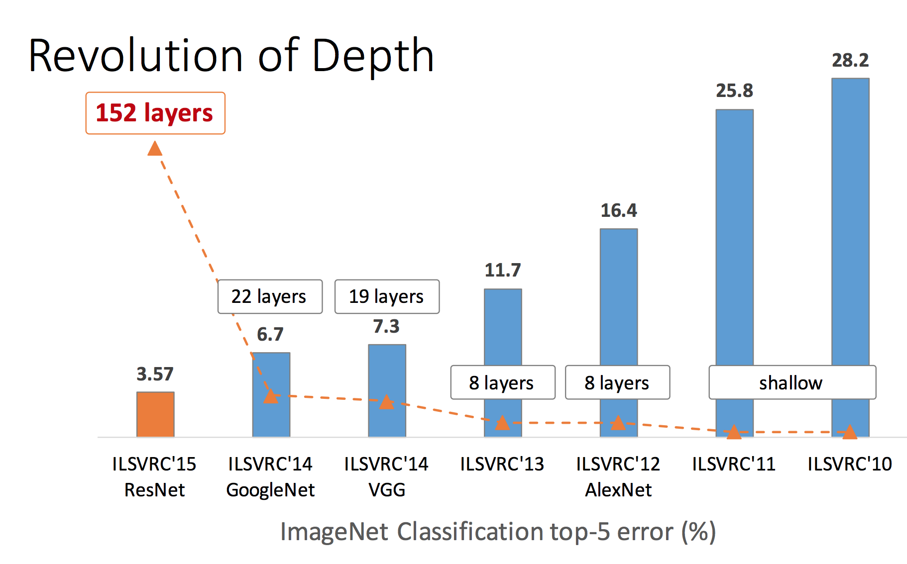
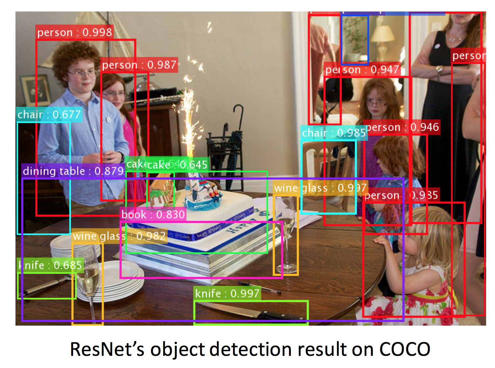
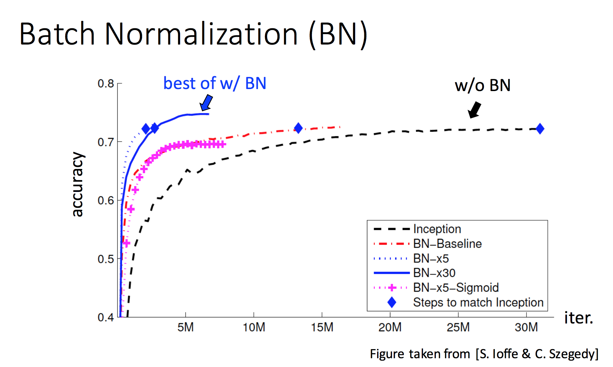
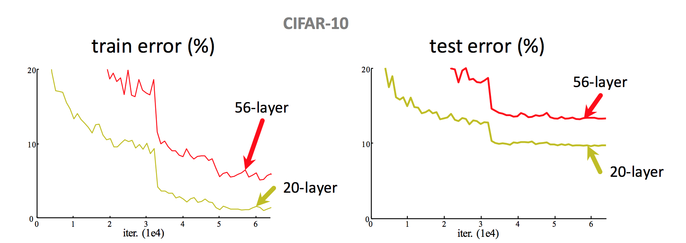
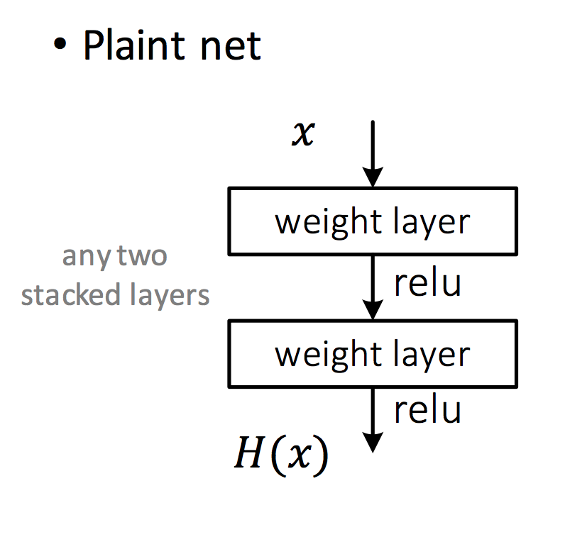
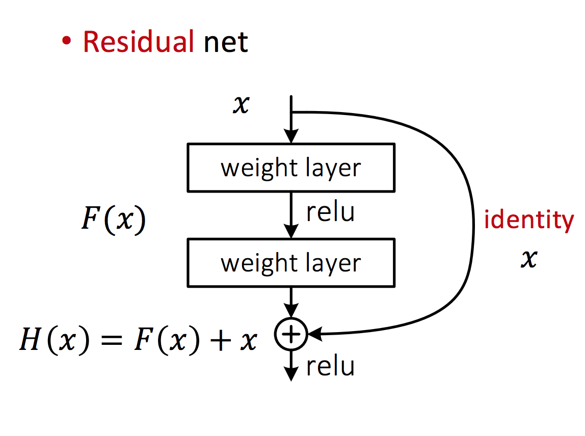
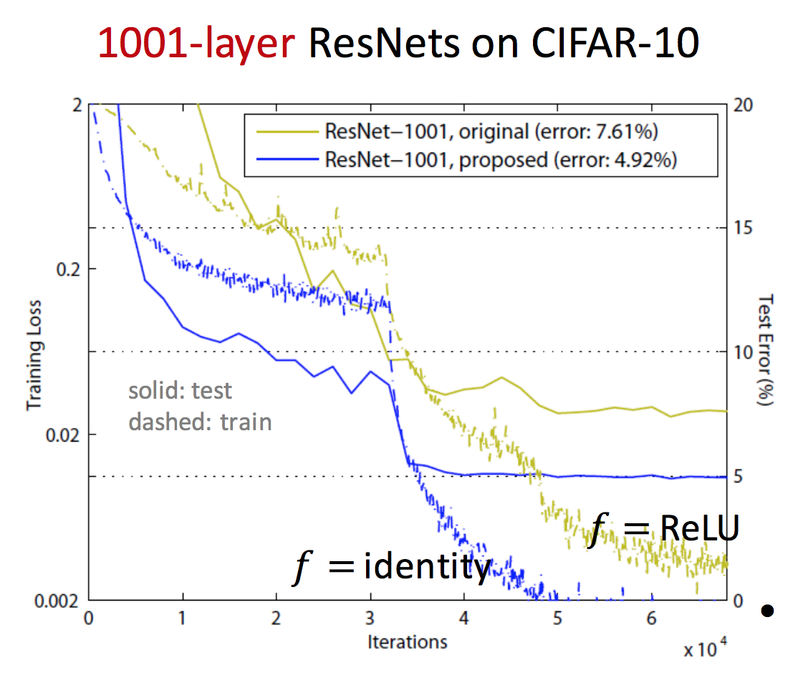

# Deep Residual Network Architectural Design

## Deep Residual Networks \(ResNets\)

* Award winning    simple    and    clean    architecture for    training    “very”    deep    nets for **computer vision**
* Invented by **Microsoft Research** in 2015
* Won **1st places**    in    all    five main tracks in ImageNet and COCO Large Scale Visual Recognition Competition in 2015
  * **ImageNet    Classification**:    “Ultra-deep”    152-layer nets    
  * **ImageNet    Detection**: 16% better    than    2nd
  * **ImageNet    Localization**: 27% better    than    2nd
  * **COCO    Detection**: 11% better    than    2nd
  * **COCO    Segmentation**: 12% better    than    2nd

#### Motivation

* Network depth is of crucial importance in neural network architectures
* Deeper networks are more difficult to train.
* Residual learning eases the training
* Enables them to be substantially deeper  with improved performance

## Training Increasingly Deeper Networks

#### Common Practices

**Initialization**

* Careful initialization of model weights
  * Avoid exploding or vanishing gradients during training

**Batch Normalization**

* Batch Normalization of each layer for each training mini-batch
  * Accelerates training
  * Less sensitive to initialization, for more stable training
  * Improves regularization of model \(better generalization\)

## Simply stacking    more layers does not improve performance

* 56-layer    CNN    has    higher    **training error and    test    error**    than    20-layer    CNN
* accuracy gets saturated and then starts degrading

## ResNet Introduces Residual Learning

Original Paper: [Deep Residual Learning for Image Recognition](https://arxiv.org/pdf/1512.03385.pdf)

 **Plain Layer Stacking**

 **Stacking with Residual Connection**

* add an identity skip connection
* layer learns residual mapping instead
* makes optimization easier expecially for deeper layers
* helps propagate signal deep into the network with less degradation

**New assumption:**

* optimal function is closer to an identity mapping than to a zero mapping
* easier for network to learn residual error
* each layer is responsible for fine-tuning the output of a previous block \(instead of having to generate the desired output from scratch\)

## Bottleneck Design

 **Practical design for going deeper**

* sandwich 3x3 conv layer with two 1x1 conv layers
* similar complexity
* better representation
* 1x1 conv reduce tensor dimensonality for 3x3 conv layer

## ResNet Provides Improvements in 3 Key Concepts

**Representation**

* training of much deeper networks
* larger feature space allows for better representation

**Optimization**

* Enable very smooth forward propagation of signal and backward propagation of error
* Greatly    ease    optimizing    deeper models

**Generalization**

* Does not overfit on training data
* Maintains good performance on test data

## ResNet Improvement: Pre-Activation

Improvements on ResNet design: [Identity Mappings in Deep Residual Networks](https://arxiv.org/pdf/1603.05027.pdf)

* ReLU    could    block    prop    when    there    are    1000    layers
* pre-activation    design    eases    optimization    and    improves    generalization

### Next Lesson

#### Implementation of a Deep Residual Neural Network

* residual skip connections
* bottleneck blocks

