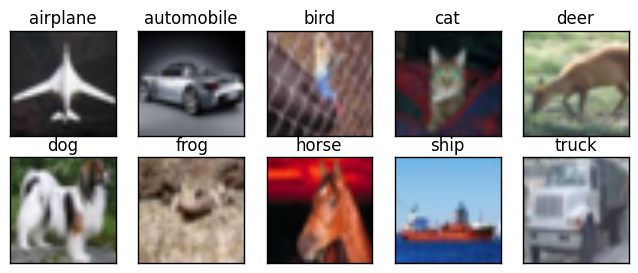

# Load and Explore Cifar10 Dataset

## Image Classification Task

Cifar10 is a famous computer-vision dataset used for object recognition.

The dataset consists of:

* 32x32 pixel colored images
* 10 classes
* 6,000 images per classes
* 50,000 images in the training set
* 10,000 images in the test set



## Imports

```python
from __future__ import absolute_import
from __future__ import division
from __future__ import print_function

import tensorflow as tf
import matplotlib
import matplotlib.pyplot as plt
import numpy as np
```

## Download and Load Cifar10 Dataset

```python
(x_train, y_train), (x_test, y_test) = tf.contrib.keras.datasets.cifar10.load_data()
```

## Training Tensor Shape

```python
x_train.shape
```

```text
(50000, 32, 32, 3)
```

## Testing Tensor Shape

```python
x_test.shape
```

```text
(10000, 32, 32, 3)
```

## Ploting Helper Function

```python
def plot_10_by_10_images(images):

    # figure size
    fig = plt.figure(figsize=(10,10))

    # plot image grid
    for x in range(10):
        for y in range(10):
            ax = fig.add_subplot(10, 10, 10*y+x+1)
            plt.imshow(images[10*y+x])
            plt.xticks(np.array([]))
            plt.yticks(np.array([]))
    plt.show()
```

## Explore Cifar10 Dataset

```python
plot_10_by_10_images(x_train[:100])
```


### Next Lesson

#### SqueezeNet Architecture

* AlexNet-level accuracy with 50x fewer parameters
* CNN Squeeze layers and delayed downsampling


