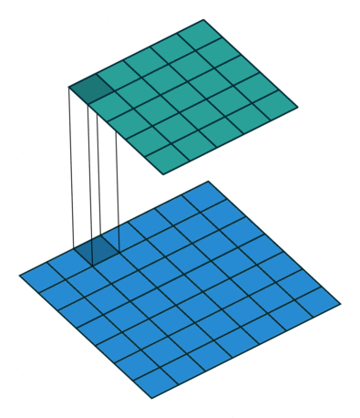
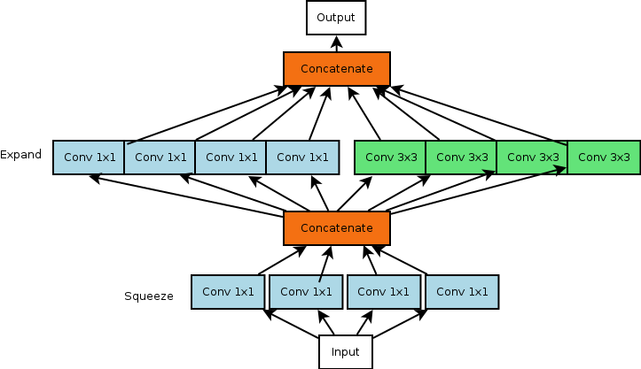

# SqueezeNet Architecture Design

## SqueezeNet

**What is SqueezeNet?**

* a deep convolutional neural network \(CNN\)
* compressed architecture design
* model contains relatively small amount of parameters
* achieve AlexNet-level accuracy on ImageNet dataset with 50x fewer parameters

**Three advantages of small CNN architectures:**

* require less communication across servers during distributed training.
* require less bandwidth to export a new model from the cloud.
* more feasible to deploy on customized hardware with limited memory.

## References and Additional Information

* [SqueezeNet Paper](https://arxiv.org/pdf/1602.07360.pdf)
* [SqueezeNet architecture explanation](http://www.kdnuggets.com/2016/09/deep-learning-reading-group-squeezenet.html)
* [1x1 convolutions explained](http://iamaaditya.github.io/2016/03/one-by-one-convolution/)

## Architectural Design Strategies

The authors outline 3 main strategies for reducing parameter size while maximizing accuracy

#### Strategy 1

> Make the network smaller by replacing 3x3 filters with 1x1 filters

* conventional 3x3 replaced by 1x1 convolution filters
* 1x1 filter has 9X fewer parameters than a 3x3 filter

### Difference between 3x3 filters and 1x1 filters

**3x3 filters**

* larger spacial receptive field
* captures spatial information of pixels close to each other.

**1x1 filters**

* looks at one pixel at the time
* caputres relationships amongst its channels
* equivalent to a fully connected layer along the channel dimension

#### Strategy 2

> Reduce the number of inputs for the remaining 3x3 filters.

* fewer inputs to conv layers result in fewer parameters
* achieved by using only 1x1 filters prior to the 3x3 conv layer
* called the squeeze layer \(description in next section\)
* total number of parameters in 3x3 conv layer = \(number of input channels\)  _\(number of filters\)_  \(3\*3\)

#### Strategy 3

> Downsample late in the network so that convolution layers have large activation maps.

* make the most of smaller number of parameters and maximize accuracy
* delaying downsampling late in the network, creates larger activation/feature maps
* departure from more traditional architectures like the VGG network that use early downsampling
* large activation maps results in a higher classification accuracy given the same number of parameters

 **VGG Architecure with early downsampling**  

**The two main ways to achieve downsampling:**

* strides &gt; 1 in the convolutional layers
* pooling layers \(eg max/average pooling\)

### General Strategy

* Strategies 1 and 2 are about carefully decreasing the quantity of parameters in a CNN while attempting to preserve accuracy.
* Strategy 3 is about maximizing accuracy on a limited budget of parameters. 

## Fire Module

**What is the Fire Module?**

* building block used in the SqueezeNet
* employs Strategies 1, 2, and 3
* comprised of squeeze layers which have only 1x1 filters \(strategy 1\)
* comprised of expand layers which have a mix of 1x1 and 3x3 convolution filters
* number of filters in squeeze layer must be less than the expand layer \(strategy 2\)

## SqueezeNet Architecture

 **Layers breakdown** 

* layer 1: regular convolution layer
* layer 2-9: fire module \(squeeze + expand layer\)
* layer 10: regular convolution layer
* layer 11: softmax layer

 **Architecure specifications** 

* gradually increase number of filters per fire module
* max-pooling with stride of 2 after layer 1,4,8
* average-pooling after layer 10
* delayed downsampling with pooling layers

### Next Lesson

#### Implementation of SqueezeNet

* Implementation of Fire module
* Implementation of full SqueezeNet model

