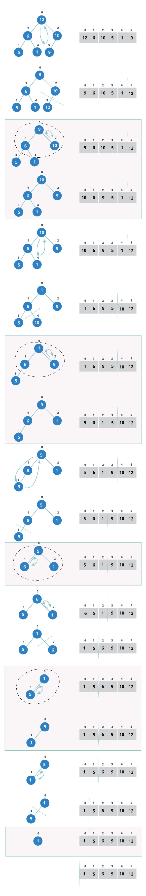

# Big O

* Time & Space Complexity
* Drop the Non-Dominant Terms
  * $${O(N^2 + N)}$$ becomes $$O(N^2)$$
  * $$O(N + log N)$$becomes $$O(N)$$
  * $$O(5*2^N + 1000N^{100})$$becomes $$O(2^N)$$



* Multi-Part Algorithms: Add vs Multiply

  * ADD $$O(A + B)$$

  ```text
  for (int a : arrA) {
      print(a);
  }
  for (int b : arrB) {
      print(b);
  }
  ```

  * MULTIPLY $$O(A * B)$$

  ```text
  for (int a : arrA) {
      for (int b : ArrB) {
          print(a + "," + b);
      }
  }
  ```

* Amortized Time

  > $$X$$adds takes $$O(X)$$time. The amortized time for each adding is $$O(1)$$.

* Log N Runtimes

  * binary search example:

  ```text
  search 9 within (1, 5, 8, 9, 11, 13, 15, 19, 21)
      compare 9 to 11 -> smaller
      search 9 within {1, 5, 8, 9}
          compare 9 to 8 -> bigger
          search 9 within {9}
              compare 9 to 9
              return
  ```

  With each comparison, we go either left or right. Half the nodes are on each side, so we cut the problem space in half each time.

* Recursive Runtime

  ```text
  int f(int n) {
      if (n <= 1) {
          return 1;
      }
      return f(n - 1) + f(n - 1);
  }
  ```

  Remember pattern: when you have a recursive function that makes multiple calls, the runtime will ofter look like $$O(branches^{depth})$$, where branches is the number of times each recursive call branches. In this case, this gives us $$O(2^N)$$.

| N | Level | \#Nodes | Also expressed as... | Or... |
| :--- | :--- | :--- | :--- | :--- |
| 4 | 0 | 1 |  | $$2^0$$ |
| 3 | 1 | 2 | 2 \* previous level = 2 | $$2^1$$ |
| 2 | 2 | 4 | 2 \* previous level = $$2 * 2^1 = 2^2$$ | $$2^2$$ |
| 1 | 3 | 8 | 2 \* previous level = $$2 * 2^2 = 2^3$$ | $$2^3$$ |

* Sorting string takes $$O(N log N)$$

### Examples

#### $$O(N)$$

```java
void f(int[] array){
    int sum = 0;
    int product = 1;
    for (int i = 0; i < array.length; i++){
        sum += array[i];
    }
    for (int i = 0; i < array.length; i++){
        product *= array[i];
    }   
    System.out.printIn(sum + ", " + product); 
}
```

#### $$O(N^2)$$

```java
void printPairs(int[] array){
    for (int i = 0; i < array.length; i++){
        for (int j = 0; j < array.length; j++){
            System.out.printIn(array[i] + ", " + array[j]); 
        }
    }
}
```

#### $$O(N^2)$$

Important to note here is line 3 in the code: `int j = i + 1` \(see page 46/47\)

```java
void printUnorderedPairs(int[] array){
    for (int i = 0; i < array.length; i++){
        for (int j = i + 1; j < array.length; j++){
            System.out.printIn(array[i] + ", " + array[j]); 
        }
    }
}
```

#### $$O(ab)$$

```java
void printUnorderedPairs(int[] arrayA, int[] arrayB){
    for (int i = 0; i < arrayA.length; i++){
        for (int j = 0; j < arrayB.length; j++){
            if (arrayA[i] < arrayB[j]):
                System.out.printIn(arrayA[i] + ", " + arrayB[j]); 
            }
        }
    }
}
```

#### $$O(ab)$$

The most inner for loop is considered as a constant -&gt; 100,000 units.

```java
void printUnorderedPairs(int[] arrayA, int[] arrayB){
    for (int i = 0; i < arrayA.length; i++){
        for (int j = 0; j < arrayB.length; j++){
            for (int k = 0; k < 100000; k++):
                System.out.printIn(arrayA[i] + ", " + arrayB[j]); 
            }
        }
    }
}
```

#### $$O(N)$$

```java
void reverse(int[] array){
    for (int i = 0; i < array.length / 2; i++) {
        int other = array.length - i - 1;
        int temp = array[i[;
        array[i] = array[other];
        array[other] = temp;
    }
}
```

#### $$O(N)$$

Balanced binary search tree \(see page 49\).

```text
int sum(Node node){
    if (node == null){
        return 0;
    }
    return sum(node.left) + node.value + sum(node.right);
}
```

#### $$O(\sqrt{n})$$

```text
boolean isPrime(int n){
    for (int x = 2; x * x <= n; x++){
        if (n % x == 0){
            return false;
        }
    }
    return true;
}
```

